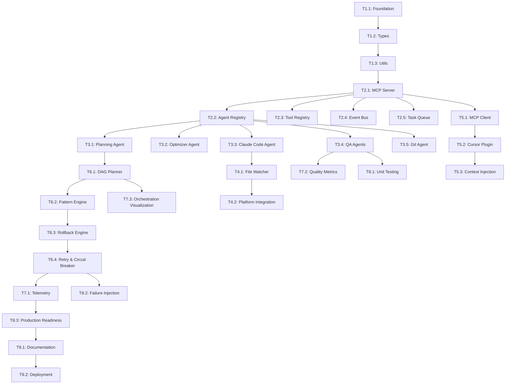

# Autonomous Development Pipeline - Enhanced TODO List

## Project Status Overview

**Current State**: Project has comprehensive documentation and architecture design, but minimal implementation. All agent directories exist but are empty. Need to build from ground up.

**Priority**: Focus on Phase 1-3 for MVP, then expand to full orchestration.

---

## ✅ Phase 1: Foundation & Infrastructure (CRITICAL)

### T1.1: Project Scaffold & Dependencies
- [ ] **T1.1.1**: Install and configure Mastra Framework
  - **Context**: Mastra Framework provides the foundation for agent registry, event bus, and workflow engine. This is the core infrastructure that all agents will build upon.
  - **Dependencies**: None (foundational)
  - **Deliverables**: Mastra Framework installed, basic configuration files
  - **Success Criteria**: Framework can start and register basic agents
  - **Estimated Time**: 1.4 min

- [ ] **T1.1.2**: Set up TypeScript project structure
  - **Context**: Establish the monorepo structure with proper TypeScript configuration, module resolution, and build pipeline for the entire project.
  - **Dependencies**: T1.1.1
  - **Deliverables**: tsconfig.json, package.json, directory structure
  - **Success Criteria**: TypeScript compilation works, proper module imports
  - **Estimated Time**: 1.4 min

- [ ] **T1.1.3**: Configure ESLint with Airbnb + Prettier
  - **Context**: Ensure code quality and consistency across the entire codebase. Airbnb style guide provides industry-standard practices.
  - **Dependencies**: T1.1.2
  - **Deliverables**: .eslintrc.json, .prettierrc, lint scripts
  - **Success Criteria**: Linting passes on existing code, auto-formatting works
  - **Estimated Time**: 1.4 min

- [ ] **T1.1.4**: Set up Jest + Vitest testing framework
  - **Context**: Establish comprehensive testing infrastructure for unit tests, integration tests, and performance testing across all agents and components.
  - **Dependencies**: T1.1.2
  - **Deliverables**: jest.config.js, vitest.config.ts, test utilities
  - **Success Criteria**: Test runner works, can execute sample tests
  - **Estimated Time**: 1.4 min

- [ ] **T1.1.5**: Configure Git hooks (husky + lint-staged)
  - **Context**: Automate code quality checks on commit and push to prevent low-quality code from entering the repository.
  - **Dependencies**: T1.1.3
  - **Deliverables**: .husky directory, lint-staged configuration
  - **Success Criteria**: Hooks trigger on commit, quality checks run automatically
  - **Estimated Time**: 1.4 min

- [ ] **T1.1.6**: Set up environment configuration system
  - **Context**: Create a flexible configuration system that supports different environments (dev, staging, prod) and allows runtime configuration of agents and services.
  - **Dependencies**: T1.1.2
  - **Deliverables**: config/ directory, environment validation
  - **Success Criteria**: Can load different configs, validation works
  - **Estimated Time**: 1.4 min

- [ ] **T1.1.7**: Configure logging with Winston
  - **Context**: Implement structured logging for debugging, monitoring, and audit trails across all agents and services.
  - **Dependencies**: T1.1.2
  - **Deliverables**: logger configuration, log formats, log levels
  - **Success Criteria**: Logs are structured, can be filtered by level
  - **Estimated Time**: 1.4 min

- [ ] **T1.1.8**: Set up error handling and monitoring
  - **Context**: Establish comprehensive error handling patterns and monitoring infrastructure to detect and respond to issues in the agent pipeline.
  - **Dependencies**: T1.1.7
  - **Deliverables**: Error handling utilities, monitoring setup
  - **Success Criteria**: Errors are caught and logged, monitoring alerts work
  - **Estimated Time**: 1.4 min

### T1.2: Core Type System
- [ ] **T1.2.1**: Define base Agent interface
  - **Context**: Create the foundational interface that all agents must implement, ensuring consistency in agent behavior, lifecycle management, and communication patterns.
  - **Dependencies**: T1.1.2
  - **Deliverables**: src/shared/types/agent.ts, base agent interface
  - **Success Criteria**: Interface is comprehensive, all future agents can implement it
  - **Estimated Time**: 1.4 min

- [ ] **T1.2.2**: Define Task and TaskQueue types
  - **Context**: Establish the data structures for task management, including task states, priorities, dependencies, and queue management for the entire pipeline.
  - **Dependencies**: T1.2.1
  - **Deliverables**: src/shared/types/task.ts, queue types
  - **Success Criteria**: Types support all task scenarios, queue operations work
  - **Estimated Time**: 1.4 min

- [ ] **T1.2.3**: Define MCP message types
  - **Context**: Create type definitions for the Model Context Protocol (MCP) messages that enable communication between Cursor IDE and the agent system.
  - **Dependencies**: T1.2.1
  - **Deliverables**: src/shared/types/mcp.ts, message schemas
  - **Success Criteria**: MCP messages are properly typed, validation works
  - **Estimated Time**: 1.4 min

- [ ] **T1.2.4**: Define orchestration pattern types
  - **Context**: Establish types for different orchestration patterns (sequential, parallel, fail-fast, etc.) to enable flexible workflow configuration.
  - **Dependencies**: T1.2.2
  - **Deliverables**: src/shared/types/orchestration.ts, pattern definitions
  - **Success Criteria**: All orchestration patterns are properly typed
  - **Estimated Time**: 1.4 min

- [ ] **T1.2.5**: Define quality gate types
  - **Context**: Create types for quality checks, thresholds, and results to standardize quality assurance across all agents and workflows.
  - **Dependencies**: T1.2.2
  - **Deliverables**: src/shared/types/quality.ts, gate definitions
  - **Success Criteria**: Quality gates are properly typed, thresholds configurable
  - **Estimated Time**: 1.4 min

- [ ] **T1.2.6**: Define event bus types
  - **Context**: Establish types for the event-driven architecture, including event types, handlers, and routing to enable loose coupling between agents.
  - **Dependencies**: T1.2.1
  - **Deliverables**: src/shared/types/events.ts, event definitions
  - **Success Criteria**: Events are properly typed, routing works
  - **Estimated Time**: 1.4 min

- [ ] **T1.2.7**: Define configuration types
  - **Context**: Create type definitions for all configuration options across agents, services, and environments to ensure type safety in configuration management.
  - **Dependencies**: T1.1.6
  - **Deliverables**: src/shared/types/config.ts, config schemas
  - **Success Criteria**: All configs are properly typed, validation works
  - **Estimated Time**: 1.4 min

### T1.3: Shared Utilities
- [ ] **T1.3.1**: Create HTTP client utilities
  - **Context**: Build reusable HTTP client with retry logic, error handling, and authentication for all agents that need to communicate with external APIs (Claude API, Git APIs, etc.).
  - **Dependencies**: T1.2.1
  - **Deliverables**: src/shared/utils/http.ts, client with retry logic
  - **Success Criteria**: HTTP client handles errors gracefully, supports retries
  - **Estimated Time**: 1.4 min

- [ ] **T1.3.2**: Create file system utilities
  - **Context**: Develop cross-platform file system utilities for reading, writing, and monitoring files that all agents will use for code generation, documentation, and configuration management.
  - **Dependencies**: T1.2.1
  - **Deliverables**: src/shared/utils/fs.ts, file operations
  - **Success Criteria**: File operations work across platforms, handle errors
  - **Estimated Time**: 1.4 min

- [ ] **T1.3.3**: Create validation utilities (Zod schemas)
  - **Context**: Implement comprehensive validation using Zod for all data structures, API responses, and configuration to ensure data integrity throughout the system.
  - **Dependencies**: T1.2.7
  - **Deliverables**: src/shared/utils/validation.ts, Zod schemas
  - **Success Criteria**: All data is properly validated, clear error messages
  - **Estimated Time**: 1.4 min

- [ ] **T1.3.4**: Create serialization utilities
  - **Context**: Build utilities for serializing/deserializing data between agents, storing state, and communicating with external systems while maintaining type safety.
  - **Dependencies**: T1.2.1
  - **Deliverables**: src/shared/utils/serialization.ts, serialization helpers
  - **Success Criteria**: Data can be serialized/deserialized safely
  - **Estimated Time**: 1.4 min

- [ ] **T1.3.5**: Create retry and circuit breaker utilities
  - **Context**: Implement resilience patterns for handling transient failures in external API calls, database operations, and inter-agent communication.
  - **Dependencies**: T1.3.1
  - **Deliverables**: src/shared/utils/resilience.ts, retry/circuit breaker
  - **Success Criteria**: System handles failures gracefully, prevents cascading failures
  - **Estimated Time**: 1.4 min

- [ ] **T1.3.6**: Create metrics and telemetry utilities
  - **Context**: Build utilities for collecting performance metrics, monitoring agent behavior, and providing observability into the system's operation and health.
  - **Dependencies**: T1.1.7
  - **Deliverables**: src/shared/utils/metrics.ts, telemetry helpers
  - **Success Criteria**: Metrics are collected, can be exported to monitoring systems
  - **Estimated Time**: 1.4 min

---

## ✅ Phase 2: MCP & Communication Infrastructure

### T2.1: MCP Server Foundation
- [ ] **T2.1.1**: Implement MCP server base class
  - **Context**: Create the foundational MCP (Model Context Protocol) server that enables communication between Cursor IDE and the agent system, handling message parsing, routing, and response formatting.
  - **Dependencies**: T1.2.3, T1.3.1
  - **Deliverables**: src/orchestration/engine/mcp-server.ts, base server class
  - **Success Criteria**: Server can start, accept connections, handle basic messages

- [ ] **T2.1.2**: Set up WebSocket server with Socket.IO
  - **Context**: Implement real-time bidirectional communication between Cursor IDE and agents using WebSockets, enabling live updates and interactive features.
  - **Dependencies**: T2.1.1
  - **Deliverables**: WebSocket server setup, connection handling
  - **Success Criteria**: WebSocket connections work, real-time communication functional

- [ ] **T2.1.3**: Implement MCP message routing
  - **Context**: Create a routing system that directs MCP messages to the appropriate agents based on message type, content, and agent capabilities.
  - **Dependencies**: T2.1.1, T1.2.6
  - **Deliverables**: Message router, routing logic
  - **Success Criteria**: Messages are routed correctly to appropriate agents

- [ ] **T2.1.4**: Add authentication and authorization
  - **Context**: Implement security measures to ensure only authorized Cursor IDE instances and users can connect to and interact with the agent system.
  - **Dependencies**: T2.1.1, T1.3.3
  - **Deliverables**: Auth middleware, permission system
  - **Success Criteria**: Unauthorized connections are rejected, permissions enforced

- [ ] **T2.1.5**: Implement connection management
  - **Context**: Build robust connection lifecycle management including connection pooling, reconnection logic, and graceful handling of disconnections.
  - **Dependencies**: T2.1.2
  - **Deliverables**: Connection manager, lifecycle handling
  - **Success Criteria**: Connections are managed properly, reconnection works

- [ ] **T2.1.6**: Add message validation and sanitization
  - **Context**: Implement comprehensive validation and sanitization of all incoming MCP messages to prevent security vulnerabilities and ensure data integrity.
  - **Dependencies**: T2.1.1, T1.3.3
  - **Deliverables**: Message validation, sanitization logic
  - **Success Criteria**: Malicious messages are blocked, data is sanitized

- [ ] **T2.1.7**: Implement heartbeat and health checks
  - **Context**: Add monitoring capabilities to detect connection health, agent availability, and system status to ensure reliable operation.
  - **Dependencies**: T2.1.2, T1.3.6
  - **Deliverables**: Heartbeat system, health check endpoints
  - **Success Criteria**: System health is monitored, issues are detected early

### T2.2: Agent Registry System
- [ ] **T2.2.1**: Create agent registration interface
  - **Context**: Build a centralized registry system that allows agents to register themselves, declare their capabilities, and be discovered by the orchestration engine.
  - **Dependencies**: T1.2.1, T1.2.7
  - **Deliverables**: src/orchestration/engine/agent-registry.ts, registration interface
  - **Success Criteria**: Agents can register successfully, capabilities are tracked

- [ ] **T2.2.2**: Implement agent lifecycle management
  - **Context**: Create comprehensive lifecycle management for agents including startup, shutdown, restart, and state persistence to ensure reliable agent operation.
  - **Dependencies**: T2.2.1, T1.3.6
  - **Deliverables**: Lifecycle manager, state persistence
  - **Success Criteria**: Agents start/stop gracefully, state is preserved

- [ ] **T2.2.3**: Add agent health monitoring
  - **Context**: Implement monitoring and alerting for agent health, performance, and availability to detect and respond to agent failures quickly.
  - **Dependencies**: T2.2.1, T1.3.6
  - **Deliverables**: Health monitoring system, alerting
  - **Success Criteria**: Agent health is monitored, failures are detected

- [ ] **T2.2.4**: Implement agent discovery
  - **Context**: Build a discovery mechanism that allows the system to find available agents, their capabilities, and current status for dynamic task assignment.
  - **Dependencies**: T2.2.1, T1.2.6
  - **Deliverables**: Discovery service, capability matching
  - **Success Criteria**: Agents are discoverable, capabilities are queryable

- [ ] **T2.2.5**: Add agent configuration management
  - **Context**: Create a configuration management system that allows runtime configuration of agent behavior, parameters, and settings without requiring restarts.
  - **Dependencies**: T2.2.1, T1.1.6
  - **Deliverables**: Configuration manager, hot reloading
  - **Success Criteria**: Agent configs can be updated at runtime

- [ ] **T2.2.6**: Implement agent dependency resolution
  - **Context**: Build a dependency resolution system that ensures agents are started in the correct order and have access to required services and resources.
  - **Dependencies**: T2.2.1, T1.2.2
  - **Deliverables**: Dependency resolver, startup ordering
  - **Success Criteria**: Agents start in correct order, dependencies are satisfied

### T2.3: Tool Registry System
- [ ] **T2.3.1**: Create tool registration interface
  - **Context**: Build a centralized tool registry that allows external tools and utilities to register themselves, declare their capabilities, and be discovered by agents for dynamic tool integration.
  - **Dependencies**: T1.2.1, T2.2.1
  - **Deliverables**: src/orchestration/engine/tool-registry.ts, registration interface
  - **Success Criteria**: Tools can register successfully, capabilities are tracked

- [ ] **T2.3.2**: Implement tool discovery and loading
  - **Context**: Create a discovery mechanism that can find available tools, load them dynamically, and make them available to agents based on task requirements and tool capabilities.
  - **Dependencies**: T2.3.1, T1.3.2
  - **Deliverables**: Tool discovery service, dynamic loading
  - **Success Criteria**: Tools are discoverable and loadable at runtime

- [ ] **T2.3.3**: Add tool validation and testing
  - **Context**: Implement validation and testing mechanisms to ensure tools are compatible, safe, and functional before they are made available to agents.
  - **Dependencies**: T2.3.2, T1.3.3
  - **Deliverables**: Tool validator, testing framework
  - **Success Criteria**: Tools are validated and tested before use

- [ ] **T2.3.4**: Implement tool versioning
  - **Context**: Build versioning support for tools to handle multiple versions, compatibility management, and gradual rollouts of tool updates.
  - **Dependencies**: T2.3.1, T1.2.7
  - **Deliverables**: Version manager, compatibility checker
  - **Success Criteria**: Multiple tool versions can coexist

- [ ] **T2.3.5**: Add tool documentation generation
  - **Context**: Create automatic documentation generation for tools to help agents understand tool capabilities, usage patterns, and integration requirements.
  - **Dependencies**: T2.3.1, T1.3.2
  - **Deliverables**: Documentation generator, API docs
  - **Success Criteria**: Tool documentation is automatically generated

- [ ] **T2.3.6**: Implement tool usage analytics
  - **Context**: Build analytics tracking for tool usage to understand which tools are most effective, identify optimization opportunities, and improve tool selection.
  - **Dependencies**: T2.3.2, T1.3.6
  - **Deliverables**: Usage tracker, analytics dashboard
  - **Success Criteria**: Tool usage is tracked and analyzed

### T2.4: Event Bus & Messaging
- [ ] **T2.4.1**: Implement event bus with Redis/RabbitMQ
  - **Context**: Build a robust event bus using Redis or RabbitMQ to enable asynchronous communication between agents, decouple system components, and support high-throughput event processing.
  - **Dependencies**: T1.2.6, T1.3.1
  - **Deliverables**: Event bus implementation, message broker integration
  - **Success Criteria**: Events are published and consumed reliably

- [ ] **T2.4.2**: Add event persistence and replay
  - **Context**: Implement event persistence to store all events for debugging, auditing, and replay capabilities to recover from failures or replay specific scenarios.
  - **Dependencies**: T2.4.1, T1.3.4
  - **Deliverables**: Event store, replay mechanism
  - **Success Criteria**: Events are persisted and can be replayed

- [ ] **T2.4.3**: Implement event filtering and routing
  - **Context**: Create intelligent event filtering and routing to direct events to appropriate handlers based on event type, content, and agent capabilities.
  - **Dependencies**: T2.4.1, T1.2.6
  - **Deliverables**: Event router, filtering logic
  - **Success Criteria**: Events are routed to correct handlers

- [ ] **T2.4.4**: Add event schema validation
  - **Context**: Implement schema validation for all events to ensure data integrity, prevent malformed events, and maintain system reliability.
  - **Dependencies**: T2.4.1, T1.3.3
  - **Deliverables**: Event schemas, validation middleware
  - **Success Criteria**: All events are validated against schemas

- [ ] **T2.4.5**: Implement dead letter queue
  - **Context**: Build a dead letter queue to handle failed events, prevent event loss, and enable manual intervention for problematic events.
  - **Dependencies**: T2.4.1, T1.3.5
  - **Deliverables**: Dead letter queue, failure handling
  - **Success Criteria**: Failed events are captured and can be retried

- [ ] **T2.4.6**: Add event monitoring and metrics
  - **Context**: Implement comprehensive monitoring and metrics for the event bus to track performance, identify bottlenecks, and ensure system health.
  - **Dependencies**: T2.4.1, T1.3.6
  - **Deliverables**: Event metrics, monitoring dashboard
  - **Success Criteria**: Event bus performance is monitored

### T2.5: Task Queue Engine
- [ ] **T2.5.1**: Implement priority queue system
  - **Context**: Build a priority queue system that can handle tasks with different priority levels, ensuring critical tasks are processed first while maintaining fair processing for all tasks.
  - **Dependencies**: T1.2.2, T1.3.5
  - **Deliverables**: Priority queue implementation, priority management
  - **Success Criteria**: Tasks are processed in priority order

- [ ] **T2.5.2**: Add task batching and grouping
  - **Context**: Implement task batching and grouping to optimize resource utilization by processing related tasks together and reducing overhead.
  - **Dependencies**: T2.5.1, T1.2.2
  - **Deliverables**: Task batcher, grouping logic
  - **Success Criteria**: Related tasks are batched efficiently

- [ ] **T2.5.3**: Implement task scheduling
  - **Context**: Create a task scheduling system that can handle delayed execution, recurring tasks, and time-based task processing.
  - **Dependencies**: T2.5.1, T1.3.6
  - **Deliverables**: Task scheduler, timing logic
  - **Success Criteria**: Tasks are scheduled and executed on time

- [ ] **T2.5.4**: Add task retry and backoff logic
  - **Context**: Implement intelligent retry logic with exponential backoff to handle transient failures and ensure task completion.
  - **Dependencies**: T2.5.1, T1.3.5
  - **Deliverables**: Retry manager, backoff strategies
  - **Success Criteria**: Failed tasks are retried with appropriate backoff

- [ ] **T2.5.5**: Implement task timeout handling
  - **Context**: Build timeout handling to prevent tasks from running indefinitely, free up resources, and maintain system responsiveness.
  - **Dependencies**: T2.5.1, T1.3.5
  - **Deliverables**: Timeout manager, resource cleanup
  - **Success Criteria**: Tasks timeout gracefully and resources are freed

- [ ] **T2.5.6**: Add task progress tracking
  - **Context**: Implement progress tracking for long-running tasks to provide visibility into task status and enable better resource management.
  - **Dependencies**: T2.5.1, T1.3.6
  - **Deliverables**: Progress tracker, status updates
  - **Success Criteria**: Task progress is tracked and reported

---

## ✅ Phase 3: Core Agents Implementation

### T3.1: Planning Agent
- [ ] **T3.1.1**: Implement PlanningAgent base class
  - **Context**: Create the foundational Planning Agent that analyzes user requests, breaks them down into actionable tasks, and creates execution plans. This is the "brain" of the autonomous development pipeline.
  - **Dependencies**: T1.2.1, T2.2.1
  - **Deliverables**: src/agents/planning/planning-agent.ts, base planning logic
  - **Success Criteria**: Agent can analyze tasks and create basic plans

- [ ] **T3.1.2**: Add Claude Sonnet integration
  - **Context**: Integrate Claude Sonnet API for natural language understanding, task analysis, and intelligent planning decisions. This enables the agent to understand complex user requirements.
  - **Dependencies**: T3.1.1, T1.3.1
  - **Deliverables**: Claude API integration, prompt engineering
  - **Success Criteria**: Agent can communicate with Claude, understands natural language

- [ ] **T3.1.3**: Implement task analysis and decomposition
  - **Context**: Build intelligent task analysis that can break down complex requirements into smaller, manageable subtasks with clear dependencies and execution order.
  - **Dependencies**: T3.1.2, T1.2.2
  - **Deliverables**: Task analysis engine, decomposition logic
  - **Success Criteria**: Complex tasks are broken down into actionable subtasks

- [ ] **T3.1.4**: Add dependency resolution
  - **Context**: Implement dependency analysis to identify task dependencies, resolve conflicts, and create optimal execution sequences that minimize bottlenecks.
  - **Dependencies**: T3.1.3, T1.2.2
  - **Deliverables**: Dependency resolver, conflict detection
  - **Success Criteria**: Dependencies are correctly identified and resolved

- [ ] **T3.1.5**: Implement priority calculation
  - **Context**: Create intelligent priority calculation based on task complexity, business value, dependencies, and resource availability to optimize execution order.
  - **Dependencies**: T3.1.3, T1.2.2
  - **Deliverables**: Priority calculator, scoring algorithm
  - **Success Criteria**: Tasks are prioritized correctly based on multiple factors

- [ ] **T3.1.6**: Add task estimation
  - **Context**: Build estimation capabilities to predict task duration, resource requirements, and complexity to help with scheduling and resource allocation.
  - **Dependencies**: T3.1.3, T1.3.6
  - **Deliverables**: Estimation engine, historical analysis
  - **Success Criteria**: Task estimates are reasonably accurate

- [ ] **T3.1.7**: Implement user communication interface
  - **Context**: Create a user-friendly interface for the Planning Agent to communicate with users, ask clarifying questions, and provide status updates on planning progress.
  - **Dependencies**: T3.1.1, T2.1.1
  - **Deliverables**: User interface, communication protocols
  - **Success Criteria**: Users can interact naturally with the planning agent

- [ ] **T3.1.8**: Add task queue management
  - **Context**: Implement queue management for planning tasks, including prioritization, batching, and load balancing to handle multiple concurrent planning requests.
  - **Dependencies**: T3.1.5, T1.2.2
  - **Deliverables**: Queue manager, load balancing
  - **Success Criteria**: Multiple planning requests are handled efficiently

- [ ] **T3.1.9**: Implement task routing logic
  - **Context**: Build intelligent routing logic that directs tasks to the most appropriate agents based on task type, agent capabilities, and current workload.
  - **Dependencies**: T3.1.3, T2.2.4
  - **Deliverables**: Routing engine, agent selection logic
  - **Success Criteria**: Tasks are routed to optimal agents

### T3.2: Optimizer Agent
- [ ] **T3.2.1**: Implement OptimizerAgent base class
  - **Context**: Create the Optimizer Agent that analyzes tasks for complexity, identifies optimization opportunities, and creates efficient execution plans to maximize throughput and resource utilization.
  - **Dependencies**: T1.2.1, T2.2.1
  - **Deliverables**: src/agents/optimizer/optimizer-agent.ts, base optimization logic
  - **Success Criteria**: Agent can analyze tasks and suggest optimizations

- [ ] **T3.2.2**: Add task complexity analysis
  - **Context**: Implement algorithms to analyze task complexity, estimate effort, and identify potential bottlenecks to optimize task execution strategies.
  - **Dependencies**: T3.2.1, T1.2.2
  - **Deliverables**: Complexity analyzer, effort estimation
  - **Success Criteria**: Task complexity is accurately assessed

- [ ] **T3.2.3**: Implement task batching logic
  - **Context**: Build intelligent batching logic that groups related tasks together to reduce overhead, improve efficiency, and optimize resource usage.
  - **Dependencies**: T3.2.1, T1.2.2
  - **Deliverables**: Task batcher, grouping algorithms
  - **Success Criteria**: Related tasks are batched efficiently

- [ ] **T3.2.4**: Add resource optimization
  - **Context**: Implement resource optimization algorithms that allocate agents, memory, and compute resources optimally based on task requirements and system capacity.
  - **Dependencies**: T3.2.2, T2.2.4
  - **Deliverables**: Resource optimizer, allocation strategies
  - **Success Criteria**: Resources are allocated optimally

- [ ] **T3.2.5**: Implement parallel execution planning
  - **Context**: Create parallel execution planning that identifies tasks that can run simultaneously, maximizes concurrency, and minimizes total execution time.
  - **Dependencies**: T3.2.3, T1.2.4
  - **Deliverables**: Parallel planner, dependency analysis
  - **Success Criteria**: Parallel execution is planned efficiently

- [ ] **T3.2.6**: Add cost-benefit analysis
  - **Context**: Implement cost-benefit analysis to evaluate optimization strategies, estimate resource costs, and make data-driven optimization decisions.
  - **Dependencies**: T3.2.4, T1.3.6
  - **Deliverables**: Cost analyzer, benefit calculator
  - **Success Criteria**: Optimization decisions are cost-effective

- [ ] **T3.2.7**: Implement optimization feedback loop
  - **Context**: Build a feedback loop that learns from optimization results, improves strategies over time, and adapts to changing system conditions.
  - **Dependencies**: T3.2.6, T1.3.6
  - **Deliverables**: Feedback system, learning algorithms
  - **Success Criteria**: Optimization strategies improve over time

### T3.3: Claude Code Agent
- [ ] **T3.3.1**: Implement ClaudeCodeAgent base class
  - **Context**: Create the Claude Code Agent that autonomously generates, modifies, and refactors code using Claude's advanced coding capabilities to implement tasks without human intervention.
  - **Dependencies**: T1.2.1, T2.2.1
  - **Deliverables**: src/agents/claude-code/claude-code-agent.ts, base code generation logic
  - **Success Criteria**: Agent can generate basic code structures

- [ ] **T3.3.2**: Add Claude API integration
  - **Context**: Integrate with Claude API to enable natural language understanding, code generation, and intelligent code analysis using Claude's advanced language model capabilities.
  - **Dependencies**: T3.3.1, T1.3.1
  - **Deliverables**: Claude API client, prompt engineering
  - **Success Criteria**: Agent can communicate with Claude API effectively

- [ ] **T3.3.3**: Implement code generation engine
  - **Context**: Build a sophisticated code generation engine that can create high-quality, maintainable code based on requirements, project context, and best practices.
  - **Dependencies**: T3.3.2, T1.3.2
  - **Deliverables**: Code generator, template system
  - **Success Criteria**: Generated code is functional and follows patterns

- [ ] **T3.3.4**: Add context injection system
  - **Context**: Implement a context injection system that provides Claude with relevant project information, existing code patterns, and requirements to generate contextually appropriate code.
  - **Dependencies**: T3.3.3, T1.3.2
  - **Deliverables**: Context injector, project analyzer
  - **Success Criteria**: Generated code matches project context

- [ ] **T3.3.5**: Implement code review and validation
  - **Context**: Build code review and validation capabilities that analyze generated code for quality, correctness, and adherence to project standards before committing.
  - **Dependencies**: T3.3.3, T1.3.3
  - **Deliverables**: Code reviewer, validation logic
  - **Success Criteria**: Generated code passes quality checks

- [ ] **T3.3.6**: Add pattern recognition
  - **Context**: Implement pattern recognition to identify and follow existing code patterns, architectural styles, and coding conventions in the project.
  - **Dependencies**: T3.3.4, T1.3.2
  - **Deliverables**: Pattern analyzer, style matcher
  - **Success Criteria**: Generated code follows project patterns

- [ ] **T3.3.7**: Implement error handling and recovery
  - **Context**: Build robust error handling and recovery mechanisms to handle code generation failures, syntax errors, and integration issues gracefully.
  - **Dependencies**: T3.3.5, T1.3.5
  - **Deliverables**: Error handler, recovery strategies
  - **Success Criteria**: Errors are handled gracefully with recovery

- [ ] **T3.3.8**: Add code quality checks
  - **Context**: Implement comprehensive code quality checks including linting, formatting, and best practice validation to ensure generated code meets high standards.
  - **Dependencies**: T3.3.5, T1.1.3
  - **Deliverables**: Quality checker, standards enforcer
  - **Success Criteria**: Generated code meets quality standards

- [ ] **T3.3.9**: Implement branch management
  - **Context**: Create branch management capabilities to create feature branches, manage code isolation, and prepare for integration with the main codebase.
  - **Dependencies**: T3.3.8, T1.3.2
  - **Deliverables**: Branch manager, isolation logic
  - **Success Criteria**: Code is properly isolated in branches

### T3.4: Quality Assurance Agents
- [ ] **T3.4.1**: Implement LintAgent
  - **Context**: Create the Lint Agent that automatically analyzes code for style violations, potential bugs, and adherence to coding standards using tools like ESLint, Pylint, etc.
  - **Dependencies**: T1.2.1, T2.2.1
  - **Deliverables**: src/agents/lint/lint-agent.ts, linting engine
  - **Success Criteria**: Agent can detect and report code quality issues

- [ ] **T3.4.2**: Implement TestsAgent
  - **Context**: Build the Tests Agent that runs automated tests, generates test coverage reports, and ensures code quality through comprehensive testing across multiple frameworks.
  - **Dependencies**: T1.2.1, T2.2.1
  - **Deliverables**: src/agents/tests/tests-agent.ts, test runner
  - **Success Criteria**: Agent can run tests and generate coverage reports

- [ ] **T3.4.3**: Implement DocumentationAgent
  - **Context**: Create the Documentation Agent that automatically generates, updates, and maintains documentation including API docs, README files, and inline documentation.
  - **Dependencies**: T1.2.1, T2.2.1
  - **Deliverables**: src/agents/documentation/documentation-agent.ts, doc generator
  - **Success Criteria**: Agent can generate and maintain documentation

- [ ] **T3.4.4**: Implement ReviewerAgent
  - **Context**: Build the Reviewer Agent that aggregates results from all quality agents, makes intelligent pass/fail decisions, and creates fix tasks for quality issues.
  - **Dependencies**: T3.4.1, T3.4.2, T3.4.3
  - **Deliverables**: src/agents/reviewer/reviewer-agent.ts, review logic
  - **Success Criteria**: Agent can make intelligent quality decisions

- [ ] **T3.4.5**: Implement QAAgent
  - **Context**: Create the QA Agent that performs end-to-end testing, user flow validation, and production readiness checks to ensure software quality.
  - **Dependencies**: T1.2.1, T2.2.1
  - **Deliverables**: src/agents/qa/qa-agent.ts, QA testing engine
  - **Success Criteria**: Agent can perform comprehensive QA testing

- [ ] **T3.4.6**: Add quality metrics collection
  - **Context**: Implement comprehensive quality metrics collection to track code quality trends, identify improvement opportunities, and measure quality over time.
  - **Dependencies**: T3.4.1, T3.4.2, T3.4.3, T1.3.6
  - **Deliverables**: Quality metrics collector, trend analysis
  - **Success Criteria**: Quality metrics are collected and analyzed

- [ ] **T3.4.7**: Implement quality gate logic
  - **Context**: Build quality gate logic that enforces quality thresholds, prevents low-quality code from progressing, and ensures consistent quality standards.
  - **Dependencies**: T3.4.4, T1.2.5
  - **Deliverables**: Quality gate enforcer, threshold management
  - **Success Criteria**: Quality gates prevent low-quality code

- [ ] **T3.4.8**: Add quality feedback loop
  - **Context**: Create a feedback loop that learns from quality results, improves quality checks over time, and adapts to project-specific quality requirements.
  - **Dependencies**: T3.4.6, T1.3.6
  - **Deliverables**: Quality feedback system, learning algorithms
  - **Success Criteria**: Quality checks improve over time

### T3.5: Git Agent
- [ ] **T3.5.1**: Implement GitAgent base class
  - **Context**: Create the Git Agent that handles all version control operations including commits, branches, merges, and repository management to maintain clean Git history.
  - **Dependencies**: T1.2.1, T2.2.1
  - **Deliverables**: src/agents/git/git-agent.ts, base Git operations
  - **Success Criteria**: Agent can perform basic Git operations

- [ ] **T3.5.2**: Add Git operations wrapper
  - **Context**: Build a comprehensive wrapper around Git operations to provide a clean API for all version control tasks including commits, pushes, pulls, and merges.
  - **Dependencies**: T3.5.1, T1.3.2
  - **Deliverables**: Git operations wrapper, command interface
  - **Success Criteria**: All Git operations are accessible via wrapper

- [ ] **T3.5.3**: Implement branch management
  - **Context**: Create intelligent branch management that creates feature branches, manages branch lifecycle, and ensures proper branch isolation for parallel development.
  - **Dependencies**: T3.5.2, T1.3.2
  - **Deliverables**: Branch manager, lifecycle handling
  - **Success Criteria**: Branches are managed properly and safely

- [ ] **T3.5.4**: Add commit message generation
  - **Context**: Implement intelligent commit message generation that creates descriptive, conventional commit messages based on code changes and task context.
  - **Dependencies**: T3.5.2, T1.3.2
  - **Deliverables**: Commit message generator, conventional commits
  - **Success Criteria**: Commit messages are descriptive and follow conventions

- [ ] **T3.5.5**: Implement merge conflict resolution
  - **Context**: Build automated merge conflict resolution capabilities that can handle common conflict scenarios and escalate complex conflicts to human review.
  - **Dependencies**: T3.5.3, T1.3.5
  - **Deliverables**: Conflict resolver, escalation logic
  - **Success Criteria**: Common conflicts are resolved automatically

- [ ] **T3.5.6**: Add Git hooks integration
  - **Context**: Integrate with Git hooks to enforce quality gates, run automated checks, and ensure code quality before commits and pushes.
  - **Dependencies**: T3.5.2, T1.1.5
  - **Deliverables**: Hook integration, quality enforcement
  - **Success Criteria**: Git hooks enforce quality standards

- [ ] **T3.5.7**: Implement version tagging
  - **Context**: Create automated version tagging that follows semantic versioning, creates release tags, and maintains version history for deployments.
  - **Dependencies**: T3.5.2, T1.3.2
  - **Deliverables**: Version tagger, semantic versioning
  - **Success Criteria**: Versions are tagged automatically and correctly

- [ ] **T3.5.8**: Add Git history analysis
  - **Context**: Implement Git history analysis to understand code evolution, identify patterns, and provide insights for future development decisions.
  - **Dependencies**: T3.5.2, T1.3.6
  - **Deliverables**: History analyzer, pattern detection
  - **Success Criteria**: Git history provides useful insights

---

## ✅ Phase 4: File System Integration

### T4.1: File Watcher System
- [ ] **T4.1.1**: Implement cross-platform file watcher
  - **Context**: Build a cross-platform file watcher that monitors file system changes across Windows, macOS, and Linux to trigger appropriate agent actions when files are modified.
  - **Dependencies**: T1.3.2, T1.2.6
  - **Deliverables**: src/orchestration/monitoring/file-watcher.ts, cross-platform watcher
  - **Success Criteria**: File changes are detected across all platforms

- [ ] **T4.1.2**: Add file change detection
  - **Context**: Implement intelligent file change detection that can distinguish between different types of changes (create, modify, delete, rename) and trigger appropriate responses.
  - **Dependencies**: T4.1.1, T1.3.2
  - **Deliverables**: Change detector, event classification
  - **Success Criteria**: Different change types are detected and classified

- [ ] **T4.1.3**: Implement debouncing and batching
  - **Context**: Add debouncing and batching mechanisms to handle rapid file changes efficiently, prevent excessive processing, and optimize performance for high-frequency changes.
  - **Dependencies**: T4.1.2, T1.3.5
  - **Deliverables**: Debouncer, batch processor
  - **Success Criteria**: Rapid changes are handled efficiently

- [ ] **T4.1.4**: Add file filtering and ignore patterns
  - **Context**: Implement file filtering and ignore patterns to focus on relevant files, exclude temporary files, and optimize performance by ignoring irrelevant changes.
  - **Dependencies**: T4.1.1, T1.3.2
  - **Deliverables**: File filter, ignore patterns
  - **Success Criteria**: Only relevant files are monitored

- [ ] **T4.1.5**: Implement file hash tracking
  - **Context**: Build file hash tracking to detect actual content changes, avoid processing unchanged files, and provide efficient change detection for large files.
  - **Dependencies**: T4.1.2, T1.3.2
  - **Deliverables**: Hash tracker, content comparison
  - **Success Criteria**: Content changes are detected accurately

- [ ] **T4.1.6**: Add change event routing
  - **Context**: Create intelligent change event routing that directs file change events to appropriate agents based on file type, change type, and agent capabilities.
  - **Dependencies**: T4.1.3, T2.4.3
  - **Deliverables**: Event router, agent selection
  - **Success Criteria**: File changes are routed to appropriate agents

- [ ] **T4.1.7**: Implement file system recovery
  - **Context**: Build file system recovery mechanisms to handle watcher failures, restart monitoring gracefully, and maintain consistency during system interruptions.
  - **Dependencies**: T4.1.1, T1.3.5
  - **Deliverables**: Recovery manager, state persistence
  - **Success Criteria**: File watcher recovers gracefully from failures

### T4.2: Platform Integration
- [ ] **T4.2.1**: Add Windows file system support
  - **Context**: Implement Windows-specific file system support including proper path handling, Windows file system APIs, and Windows-specific optimizations for file watching.
  - **Dependencies**: T4.1.1, T1.3.2
  - **Deliverables**: Windows file system adapter, path handling
  - **Success Criteria**: File watching works reliably on Windows

- [ ] **T4.2.2**: Add macOS file system support
  - **Context**: Implement macOS-specific file system support including FSEvents integration, macOS file system APIs, and macOS-specific optimizations for file watching.
  - **Dependencies**: T4.1.1, T1.3.2
  - **Deliverables**: macOS file system adapter, FSEvents integration
  - **Success Criteria**: File watching works reliably on macOS

- [ ] **T4.2.3**: Add Linux file system support
  - **Context**: Implement Linux-specific file system support including inotify integration, Linux file system APIs, and Linux-specific optimizations for file watching.
  - **Dependencies**: T4.1.1, T1.3.2
  - **Deliverables**: Linux file system adapter, inotify integration
  - **Success Criteria**: File watching works reliably on Linux

- [ ] **T4.2.4**: Implement platform-specific optimizations
  - **Context**: Create platform-specific optimizations that leverage native file system capabilities, improve performance, and reduce resource usage on each platform.
  - **Dependencies**: T4.2.1, T4.2.2, T4.2.3
  - **Deliverables**: Platform optimizations, performance tuning
  - **Success Criteria**: File watching is optimized for each platform

- [ ] **T4.2.5**: Add file system monitoring
  - **Context**: Implement comprehensive file system monitoring that tracks performance, resource usage, and health of the file watching system across all platforms.
  - **Dependencies**: T4.2.4, T1.3.6
  - **Deliverables**: File system monitor, health tracking
  - **Success Criteria**: File system performance is monitored

- [ ] **T4.2.6**: Implement file system error handling
  - **Context**: Build robust error handling for file system operations including permission errors, disk space issues, and file system corruption scenarios.
  - **Dependencies**: T4.2.5, T1.3.5
  - **Deliverables**: Error handler, recovery mechanisms
  - **Success Criteria**: File system errors are handled gracefully

---

## ✅ Phase 5: Cursor IDE Integration

### T5.1: MCP Client Implementation
- [ ] **T5.1.1**: Create MCP client for Cursor
  - **Context**: Build an MCP client that can connect to the MCP server from Cursor IDE, enabling bidirectional communication between the IDE and the autonomous development pipeline.
  - **Dependencies**: T1.2.3, T1.3.1
  - **Deliverables**: src/integration/cursor/mcp-client.ts, client implementation
  - **Success Criteria**: Client can connect to MCP server from Cursor

- [ ] **T5.1.2**: Implement WebSocket connection
  - **Context**: Create a robust WebSocket connection that provides real-time communication between Cursor IDE and the agent system, enabling live updates and interactive features.
  - **Dependencies**: T5.1.1, T2.1.2
  - **Deliverables**: WebSocket client, connection management
  - **Success Criteria**: Real-time communication works reliably

- [ ] **T5.1.3**: Add message serialization
  - **Context**: Implement message serialization and deserialization to ensure proper data exchange between Cursor IDE and the agent system, maintaining type safety and data integrity.
  - **Dependencies**: T5.1.1, T1.3.4
  - **Deliverables**: Message serializer, type safety
  - **Success Criteria**: Messages are properly serialized and deserialized

- [ ] **T5.1.4**: Implement connection retry logic
  - **Context**: Build intelligent connection retry logic that handles network interruptions, server restarts, and connection failures gracefully to maintain reliable communication.
  - **Dependencies**: T5.1.2, T1.3.5
  - **Deliverables**: Retry manager, connection recovery
  - **Success Criteria**: Connection failures are handled gracefully

- [ ] **T5.1.5**: Add connection health monitoring
  - **Context**: Implement connection health monitoring to detect connection issues, provide status feedback to users, and enable proactive connection management.
  - **Dependencies**: T5.1.2, T1.3.6
  - **Deliverables**: Health monitor, status indicators
  - **Success Criteria**: Connection health is monitored and reported

- [ ] **T5.1.6**: Implement client authentication
  - **Context**: Add client authentication to ensure secure communication between Cursor IDE and the agent system, preventing unauthorized access and maintaining security.
  - **Dependencies**: T5.1.1, T2.1.4
  - **Deliverables**: Authentication client, security protocols
  - **Success Criteria**: Only authenticated clients can connect

### T5.2: Cursor Plugin Development
- [ ] **T5.2.1**: Create Cursor extension structure
  - **Context**: Build the foundational structure for the Cursor IDE extension that will integrate the autonomous development pipeline directly into the developer's workflow.
  - **Dependencies**: T5.1.1, T1.2.3
  - **Deliverables**: Cursor extension manifest, basic structure
  - **Success Criteria**: Extension can be installed and loaded in Cursor

- [ ] **T5.2.2**: Implement task panel UI
  - **Context**: Create a user-friendly task panel that displays current tasks, their status, and allows users to interact with the autonomous development pipeline directly from the IDE.
  - **Dependencies**: T5.2.1, T2.1.1
  - **Deliverables**: Task panel component, UI framework
  - **Success Criteria**: Users can view and interact with tasks in the IDE

- [ ] **T5.2.3**: Add status display
  - **Context**: Implement real-time status display showing agent progress, task completion, and system health to keep users informed of pipeline status.
  - **Dependencies**: T5.2.2, T2.1.2
  - **Deliverables**: Status indicators, progress tracking
  - **Success Criteria**: Users can see real-time status updates

- [ ] **T5.2.4**: Implement task interaction
  - **Context**: Build interactive capabilities allowing users to approve, reject, modify, or provide feedback on agent-generated tasks and results.
  - **Dependencies**: T5.2.2, T2.1.3
  - **Deliverables**: Interaction components, feedback system
  - **Success Criteria**: Users can interact with tasks and provide feedback

- [ ] **T5.2.5**: Add configuration interface
  - **Context**: Create a configuration interface that allows users to customize agent behavior, orchestration patterns, and system settings directly from the IDE.
  - **Dependencies**: T5.2.1, T1.1.6
  - **Deliverables**: Configuration UI, settings management
  - **Success Criteria**: Users can configure the system from the IDE

- [ ] **T5.2.6**: Implement autonomous mode toggle
  - **Context**: Add a toggle to enable/disable autonomous mode, allowing users to control when the system operates automatically versus requiring manual approval.
  - **Dependencies**: T5.2.2, T6.2.1
  - **Deliverables**: Mode toggle, autonomous controls
  - **Success Criteria**: Users can control autonomous behavior

- [ ] **T5.2.7**: Add pattern selection interface
  - **Context**: Create an interface for users to select and configure different orchestration patterns (sequential, parallel, fail-fast, etc.) based on their needs.
  - **Dependencies**: T5.2.5, T6.2.1
  - **Deliverables**: Pattern selector, configuration UI
  - **Success Criteria**: Users can select and configure orchestration patterns

### T5.3: Context Injection System
- [ ] **T5.3.1**: Implement code context extraction
  - **Context**: Build a system that extracts relevant code context from the current file, including imports, function definitions, and related code to provide comprehensive context to agents.
  - **Dependencies**: T5.2.1, T1.3.2
  - **Deliverables**: Context extractor, code analysis
  - **Success Criteria**: Relevant code context is extracted accurately

- [ ] **T5.3.2**: Add file context injection
  - **Context**: Implement file context injection that provides agents with information about the current file, its location in the project, and related files to enable context-aware operations.
  - **Dependencies**: T5.3.1, T1.3.2
  - **Deliverables**: File context injector, project structure
  - **Success Criteria**: File context is injected properly

- [ ] **T5.3.3**: Implement project context loading
  - **Context**: Create project context loading that provides agents with comprehensive project information including architecture, dependencies, and configuration to enable project-aware decisions.
  - **Dependencies**: T5.3.2, T1.3.2
  - **Deliverables**: Project context loader, architecture analysis
  - **Success Criteria**: Project context is loaded and available

- [ ] **T5.3.4**: Add dependency context
  - **Context**: Implement dependency context that provides agents with information about project dependencies, their versions, and relationships to enable dependency-aware operations.
  - **Dependencies**: T5.3.3, T1.3.2
  - **Deliverables**: Dependency analyzer, version tracking
  - **Success Criteria**: Dependency context is available to agents

- [ ] **T5.3.5**: Implement context caching
  - **Context**: Build context caching to improve performance by storing frequently accessed context information and avoiding redundant context extraction operations.
  - **Dependencies**: T5.3.1, T1.3.4
  - **Deliverables**: Context cache, performance optimization
  - **Success Criteria**: Context access is fast and efficient

- [ ] **T5.3.6**: Add context validation
  - **Context**: Implement context validation to ensure that injected context is accurate, complete, and relevant to the current task to prevent errors from incorrect context.
  - **Dependencies**: T5.3.5, T1.3.3
  - **Deliverables**: Context validator, quality checks
  - **Success Criteria**: Injected context is validated and accurate

---

## ✅ Phase 6: Orchestration Engine

### T6.1: DAG Planner
- [ ] **T6.1.1**: Implement DAG construction
  - **Context**: Build a Directed Acyclic Graph (DAG) construction engine that creates execution graphs from task dependencies, enabling complex workflow orchestration and parallel execution planning.
  - **Dependencies**: T3.1.4, T1.2.2
  - **Deliverables**: src/orchestration/engine/dag-planner.ts, graph construction
  - **Success Criteria**: DAGs are constructed correctly from task dependencies

- [ ] **T6.1.2**: Add dependency resolution
  - **Context**: Implement intelligent dependency resolution that analyzes task relationships, identifies implicit dependencies, and resolves conflicts to create optimal execution paths.
  - **Dependencies**: T6.1.1, T3.1.4
  - **Deliverables**: Dependency resolver, conflict detection
  - **Success Criteria**: Dependencies are resolved correctly, conflicts are handled

- [ ] **T6.1.3**: Implement cycle detection
  - **Context**: Build cycle detection algorithms to identify and prevent circular dependencies in task graphs, ensuring the DAG remains acyclic and executable.
  - **Dependencies**: T6.1.1, T1.3.3
  - **Deliverables**: Cycle detector, validation logic
  - **Success Criteria**: Cycles are detected and prevented

- [ ] **T6.1.4**: Add topological sorting
  - **Context**: Implement topological sorting to determine the optimal execution order of tasks while respecting dependencies and maximizing parallelization opportunities.
  - **Dependencies**: T6.1.1, T6.1.3
  - **Deliverables**: Topological sorter, execution ordering
  - **Success Criteria**: Tasks are ordered optimally for execution

- [ ] **T6.1.5**: Implement parallel execution planning
  - **Context**: Create parallel execution planning that identifies tasks that can run simultaneously, optimizes resource utilization, and minimizes total execution time.
  - **Dependencies**: T6.1.4, T1.2.4
  - **Deliverables**: Parallel planner, resource optimization
  - **Success Criteria**: Parallel execution is planned efficiently

- [ ] **T6.1.6**: Add resource allocation
  - **Context**: Implement intelligent resource allocation that assigns agents, compute resources, and memory to tasks based on requirements, availability, and optimization goals.
  - **Dependencies**: T6.1.5, T2.2.4
  - **Deliverables**: Resource allocator, capacity planning
  - **Success Criteria**: Resources are allocated optimally

- [ ] **T6.1.7**: Implement DAG visualization
  - **Context**: Build visualization capabilities for DAGs to help users understand task relationships, execution order, and identify bottlenecks or optimization opportunities.
  - **Dependencies**: T6.1.1, T1.3.2
  - **Deliverables**: DAG visualizer, interactive graphs
  - **Success Criteria**: DAGs are visualized clearly and interactively

### T6.2: Pattern Engine
- [ ] **T6.2.1**: Implement pattern registry
  - **Context**: Create a centralized pattern registry that stores and manages different orchestration patterns (sequential, parallel, fail-fast, etc.) for flexible workflow configuration.
  - **Dependencies**: T1.2.4, T2.2.1
  - **Deliverables**: src/orchestration/patterns/pattern-registry.ts, pattern storage
  - **Success Criteria**: Patterns can be registered and retrieved

- [ ] **T6.2.2**: Add pattern selection logic
  - **Context**: Implement intelligent pattern selection logic that chooses the most appropriate orchestration pattern based on task characteristics, system load, and user preferences.
  - **Dependencies**: T6.2.1, T1.2.4
  - **Deliverables**: Pattern selector, decision logic
  - **Success Criteria**: Appropriate patterns are selected automatically

- [ ] **T6.2.3**: Implement pattern execution
  - **Context**: Build pattern execution engine that can execute different orchestration patterns, coordinate agent activities, and manage workflow state according to pattern specifications.
  - **Dependencies**: T6.2.2, T6.1.1
  - **Deliverables**: Pattern executor, workflow coordinator
  - **Success Criteria**: Patterns are executed correctly

- [ ] **T6.2.4**: Add pattern composition
  - **Context**: Implement pattern composition that allows combining multiple patterns to create complex workflows, enabling sophisticated orchestration strategies.
  - **Dependencies**: T6.2.3, T1.2.4
  - **Deliverables**: Pattern composer, workflow builder
  - **Success Criteria**: Complex patterns can be composed

- [ ] **T6.2.5**: Implement pattern optimization
  - **Context**: Create pattern optimization that analyzes pattern performance, identifies bottlenecks, and suggests improvements to enhance workflow efficiency.
  - **Dependencies**: T6.2.3, T1.3.6
  - **Deliverables**: Pattern optimizer, performance analyzer
  - **Success Criteria**: Pattern performance is optimized

- [ ] **T6.2.6**: Add pattern feedback collection
  - **Context**: Implement pattern feedback collection to gather metrics, user feedback, and performance data to improve pattern selection and execution over time.
  - **Dependencies**: T6.2.5, T1.3.6
  - **Deliverables**: Feedback collector, metrics aggregation
  - **Success Criteria**: Pattern feedback is collected and analyzed

- [ ] **T6.2.7**: Implement pattern learning
  - **Context**: Build pattern learning capabilities that use collected feedback to improve pattern selection, optimize execution strategies, and adapt to changing requirements.
  - **Dependencies**: T6.2.6, T1.3.6
  - **Deliverables**: Learning engine, adaptive patterns
  - **Success Criteria**: Patterns improve through learning

### T6.3: Rollback Engine
- [ ] **T6.3.1**: Implement state snapshots
  - **Context**: Create a state snapshot system that captures system state at critical points to enable reliable rollback to previous states when failures occur.
  - **Dependencies**: T1.3.4, T1.2.2
  - **Deliverables**: State snapshot manager, checkpoint system
  - **Success Criteria**: System state can be captured and restored

- [ ] **T6.3.2**: Add rollback triggers
  - **Context**: Implement intelligent rollback triggers that automatically detect failure conditions and initiate rollback procedures to maintain system stability.
  - **Dependencies**: T6.3.1, T1.3.6
  - **Deliverables**: Rollback trigger system, failure detection
  - **Success Criteria**: Rollbacks are triggered automatically on failures

- [ ] **T6.3.3**: Implement compensation logic
  - **Context**: Build compensation logic that can undo changes, restore previous states, and handle partial rollbacks to ensure system consistency during failures.
  - **Dependencies**: T6.3.2, T1.3.5
  - **Deliverables**: Compensation engine, state restoration
  - **Success Criteria**: Changes can be compensated and undone

- [ ] **T6.3.4**: Add rollback validation
  - **Context**: Implement rollback validation to ensure that rollback operations are safe, complete, and don't introduce new issues during the recovery process.
  - **Dependencies**: T6.3.3, T1.3.3
  - **Deliverables**: Rollback validator, safety checks
  - **Success Criteria**: Rollbacks are validated and safe

- [ ] **T6.3.5**: Implement rollback testing
  - **Context**: Create rollback testing capabilities to verify rollback procedures work correctly, test failure scenarios, and ensure reliable recovery mechanisms.
  - **Dependencies**: T6.3.4, T1.1.4
  - **Deliverables**: Rollback test suite, failure simulation
  - **Success Criteria**: Rollback procedures are thoroughly tested

- [ ] **T6.3.6**: Add rollback metrics
  - **Context**: Implement rollback metrics collection to track rollback frequency, success rates, and performance to improve rollback strategies over time.
  - **Dependencies**: T6.3.5, T1.3.6
  - **Deliverables**: Rollback metrics, performance tracking
  - **Success Criteria**: Rollback performance is measured and tracked

### T6.4: Retry & Circuit Breaker
- [ ] **T6.4.1**: Implement retry policies
- [ ] **T6.4.2**: Add exponential backoff
- [ ] **T6.4.3**: Implement circuit breaker pattern
- [ ] **T6.4.4**: Add failure detection
- [ ] **T6.4.5**: Implement recovery logic
- [ ] **T6.4.6**: Add health monitoring

---

## ✅ Phase 7: Observability & Monitoring

### T7.1: Telemetry System
- [ ] **T7.1.1**: Implement metrics collection
- [ ] **T7.1.2**: Add performance monitoring
- [ ] **T7.1.3**: Implement error tracking
- [ ] **T7.1.4**: Add resource monitoring
- [ ] **T7.1.5**: Implement alerting system
- [ ] **T7.1.6**: Add log aggregation
- [ ] **T7.1.7**: Implement dashboard creation

### T7.2: Quality Metrics
- [ ] **T7.2.1**: Implement code quality metrics
- [ ] **T7.2.2**: Add test coverage tracking
- [ ] **T7.2.3**: Implement performance benchmarks
- [ ] **T7.2.4**: Add security scanning
- [ ] **T7.2.5**: Implement documentation coverage
- [ ] **T7.2.6**: Add quality trend analysis

### T7.3: Orchestration Visualization
- [ ] **T7.3.1**: Create DAG visualizer
- [ ] **T7.3.2**: Add real-time status display
- [ ] **T7.3.3**: Implement task flow tracking
- [ ] **T7.3.4**: Add performance heatmaps
- [ ] **T7.3.5**: Implement pattern effectiveness display
- [ ] **T7.3.6**: Add historical analysis

---

## ✅ Phase 8: Testing & Reliability

### T8.1: Unit Testing
- [ ] **T8.1.1**: Write agent unit tests
- [ ] **T8.1.2**: Add orchestration tests
- [ ] **T8.1.3**: Implement integration tests
- [ ] **T8.1.4**: Add end-to-end tests
- [ ] **T8.1.5**: Implement performance tests
- [ ] **T8.1.6**: Add chaos engineering tests

### T8.2: Failure Injection
- [ ] **T8.2.1**: Implement fault injection
- [ ] **T8.2.2**: Add network failure simulation
- [ ] **T8.2.3**: Implement agent failure testing
- [ ] **T8.2.4**: Add resource exhaustion tests
- [ ] **T8.2.5**: Implement recovery testing
- [ ] **T8.2.6**: Add stress testing

### T8.3: Production Readiness
- [ ] **T8.3.1**: Implement health checks
- [ ] **T8.3.2**: Add graceful shutdown
- [ ] **T8.3.3**: Implement configuration validation
- [ ] **T8.3.4**: Add security hardening
- [ ] **T8.3.5**: Implement backup and recovery
- [ ] **T8.3.6**: Add monitoring and alerting

---

## ✅ Phase 9: Documentation & Deployment

### T9.1: Documentation
- [ ] **T9.1.1**: Write API documentation
- [ ] **T9.1.2**: Add deployment guides
- [ ] **T9.1.3**: Implement user manuals
- [ ] **T9.1.4**: Add troubleshooting guides
- [ ] **T9.1.5**: Implement developer guides
- [ ] **T9.1.6**: Add architecture documentation

### T9.2: Deployment
- [ ] **T9.2.1**: Create Docker containers
- [ ] **T9.2.2**: Add Kubernetes manifests
- [ ] **T9.2.3**: Implement CI/CD pipelines
- [ ] **T9.2.4**: Add environment management
- [ ] **T9.2.5**: Implement blue-green deployment
- [ ] **T9.2.6**: Add rollback procedures

---

## 🚨 CRITICAL MISSING COMPONENTS

### Infrastructure Gaps
- [ ] **Database Layer**: No persistence layer for tasks, agents, or events
- [ ] **Configuration Management**: No centralized config system
- [ ] **Security Framework**: No authentication, authorization, or encryption
- [ ] **Error Handling**: No comprehensive error management system
- [ ] **Logging Infrastructure**: No structured logging or log aggregation
- [ ] **Monitoring Stack**: No metrics, alerting, or health checks

### Agent Implementation Gaps
- [ ] **Base Agent Class**: No common agent interface or lifecycle
- [ ] **Tool Integration**: No standardized tool interface
- [ ] **State Management**: No agent state persistence or recovery
- [ ] **Communication Protocol**: No inter-agent messaging system
- [ ] **Resource Management**: No agent resource allocation or limits

### Orchestration Gaps
- [ ] **Workflow Engine**: No DAG execution engine
- [ ] **Pattern Registry**: No orchestration pattern system
- [ ] **Event Bus**: No event-driven architecture
- [ ] **Task Queue**: No priority queue or scheduling
- [ ] **Rollback System**: No state management or recovery

### Integration Gaps
- [ ] **MCP Protocol**: No MCP server implementation
- [ ] **Cursor Plugin**: No IDE integration
- [ ] **File Watcher**: No file system monitoring
- [ ] **Git Integration**: No version control automation
- [ ] **Quality Gates**: No automated quality checks

---

## 📊 Task Dependencies

---

## 🎯 Immediate Next Steps (Week 1)

1. **T1.1.1**: Install Mastra Framework and set up project structure
2. **T1.2.1**: Define base Agent interface and core types
3. **T1.3.1**: Create essential utility functions
4. **T2.1.1**: Implement basic MCP server
5. **T2.2.1**: Create agent registry foundation

## 📈 Success Metrics

- **Week 1**: Basic project structure and MCP server running
- **Week 2**: First agent (Planning) implemented and tested
- **Week 3**: Core orchestration engine functional
- **Week 4**: End-to-end workflow working with Cursor integration
- **Month 2**: Full agent ecosystem with quality gates
- **Month 3**: Production-ready with monitoring and reliability features