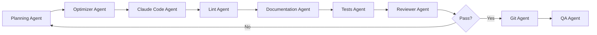
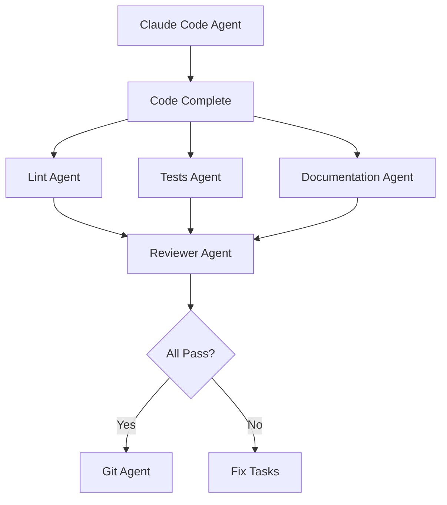
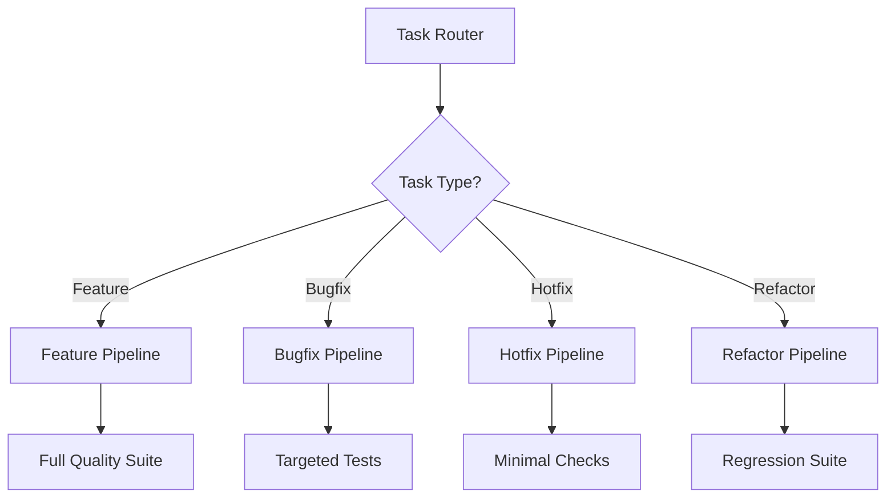

# Agent Orchestration Patterns for Autonomous Development Pipeline

## Overview

This document presents a comprehensive collection of orchestration patterns for coordinating multiple AI agents in an autonomous development pipeline. Each pattern addresses specific scenarios and optimizes for different goals such as speed, quality, resource efficiency, or risk mitigation.

## Core Orchestration Patterns

### 1. **Sequential Quality Gate Pattern**
*Ensures maximum quality by running agents in strict sequence*



**Use Case**: Critical production code where quality trumps speed
**Pros**: Maximum quality assurance, clear accountability
**Cons**: Slowest pattern, potential bottlenecks

### 2. **Parallel Quality Check Pattern**
*Runs quality agents simultaneously for faster feedback*



**Use Case**: Standard development workflow
**Pros**: Faster than sequential, good balance
**Cons**: Resource intensive during quality check phase

### 3. **Fail-Fast Pattern**
*Stops execution at first failure to save resources*

```typescript
const failFastOrchestration = async (task: Task) => {
  const stages = [
    { agent: 'optimizer', critical: true },
    { agent: 'claudeCode', critical: true },
    { agent: 'lint', critical: true },
    { agent: 'tests', critical: true },
    { agent: 'documentation', critical: false },
    { agent: 'git', critical: true }
  ];
  
  for (const stage of stages) {
    const result = await runAgent(stage.agent, task);
    if (!result.success && stage.critical) {
      await createFixTask(result);
      return { failed: stage.agent, result };
    }
  }
  
  return { success: true };
};
```

**Use Case**: Resource-constrained environments
**Pros**: Saves compute resources, quick failure detection
**Cons**: No parallel insights, may miss multiple issues

### 4. **Continuous Integration Pattern**
*Agents run continuously on changes*

```yaml
triggers:
  - event: code_change
    agents:
      - lint: { mode: incremental }
      - tests: { mode: affected_only }
      - documentation: { mode: check_coverage }
  
  - event: commit_ready
    agents:
      - reviewer: { mode: full }
      - git: { mode: commit_and_push }
  
  - event: branch_merge
    agents:
      - qa: { mode: integration_tests }
```

**Use Case**: Active development with frequent changes
**Pros**: Immediate feedback, catches issues early
**Cons**: High resource usage, potential agent conflicts

### 5. **Batch Processing Pattern**
*Groups related tasks for efficient processing*

```typescript
class BatchOrchestrator {
  async processBatch(tasks: Task[]) {
    // Group by similarity
    const batches = this.groupTasks(tasks, {
      byModule: true,
      byComplexity: true,
      maxBatchSize: 10
    });
    
    for (const batch of batches) {
      // Process batch in parallel
      await Promise.all(batch.map(task => 
        this.processTask(task)
      ));
      
      // Single quality check for batch
      await this.batchQualityCheck(batch);
      
      // Batch commit
      await this.gitAgent.batchCommit(batch);
    }
  }
}
```

**Use Case**: Large refactoring or feature implementations
**Pros**: Efficient resource usage, atomic commits
**Cons**: Delayed feedback, complex error handling

### 6. **Priority-Based Orchestration**
*Allocates agents based on task priority*

```typescript
const priorityOrchestration = {
  critical: {
    agents: ['optimizer', 'claudeCode', 'lint', 'tests', 'reviewer', 'git'],
    parallel: false,
    qualityThreshold: 1.0
  },
  
  high: {
    agents: ['optimizer', 'claudeCode', ['lint', 'tests'], 'reviewer', 'git'],
    parallel: true,
    qualityThreshold: 0.95
  },
  
  medium: {
    agents: ['claudeCode', ['lint', 'tests'], 'git'],
    parallel: true,
    qualityThreshold: 0.90
  },
  
  low: {
    agents: ['claudeCode', 'lint', 'git'],
    parallel: false,
    qualityThreshold: 0.85
  }
};
```

**Use Case**: Mixed priority workloads
**Pros**: Resource optimization, risk-appropriate checking
**Cons**: Complex configuration, potential priority inversion

### 7. **Speculative Execution Pattern**
*Runs multiple approaches in parallel*

```typescript
async function speculativeExecution(task: Task) {
  // Try multiple optimization strategies
  const strategies = await Promise.all([
    optimizerAgent.optimize(task, { strategy: 'decompose' }),
    optimizerAgent.optimize(task, { strategy: 'batch' }),
    optimizerAgent.optimize(task, { strategy: 'as-is' })
  ]);
  
  // Pick best result
  const best = strategies.reduce((a, b) => 
    a.score > b.score ? a : b
  );
  
  // Continue with best approach
  return claudeCodeAgent.implement(best);
}
```

**Use Case**: Complex tasks with unclear approach
**Pros**: Finds optimal solution, reduces rework
**Cons**: High resource usage, complex result merging

### 8. **Canary Deployment Pattern**
*Tests changes on subset before full rollout*

```yaml
canary_stages:
  - stage: alpha
    percentage: 10
    agents: [claudeCode, lint, tests]
    success_criteria: { test_pass_rate: 100 }
  
  - stage: beta
    percentage: 50
    agents: [claudeCode, lint, tests, documentation]
    success_criteria: { test_pass_rate: 98 }
  
  - stage: production
    percentage: 100
    agents: [all]
    success_criteria: { test_pass_rate: 95 }
```

**Use Case**: High-risk changes, production systems
**Pros**: Risk mitigation, gradual rollout
**Cons**: Slower deployment, complex orchestration

### 9. **Self-Healing Pattern**
*Automatically fixes issues without human intervention*

```typescript
class SelfHealingOrchestrator {
  async executeSelfHealing(task: Task, maxRetries: number = 3) {
    let attempt = 0;
    let lastError: Error;
    
    while (attempt < maxRetries) {
      try {
        // Normal execution
        const result = await this.executeTask(task);
        
        if (result.hasIssues) {
          // Create fix task
          const fixTask = await this.createFixTask(result.issues);
          
          // Execute fix
          await this.executeTask(fixTask);
          
          // Retry original task
          attempt++;
          continue;
        }
        
        return result;
      } catch (error) {
        lastError = error;
        attempt++;
        
        // Analyze error and create targeted fix
        const diagnosis = await this.diagnoseError(error);
        await this.applyFix(diagnosis);
      }
    }
    
    throw new Error(`Failed after ${maxRetries} attempts: ${lastError}`);
  }
}
```

**Use Case**: Continuous operation requirements
**Pros**: Reduces manual intervention, improves uptime
**Cons**: Can mask systematic issues, complex diagnostics

### 10. **Consensus Pattern**
*Multiple agents vote on decisions*

```typescript
interface ConsensusConfig {
  agents: string[];
  votingThreshold: number;
  tieBreaker: string;
}

async function consensusDecision(
  code: Code,
  config: ConsensusConfig
): Promise<Decision> {
  const votes = await Promise.all(
    config.agents.map(agent => 
      agent.evaluate(code)
    )
  );
  
  const decision = {
    approve: votes.filter(v => v.approve).length,
    reject: votes.filter(v => !v.approve).length,
    reasons: votes.map(v => v.reason)
  };
  
  if (decision.approve / votes.length >= config.votingThreshold) {
    return { approved: true, reasons: decision.reasons };
  }
  
  return { approved: false, reasons: decision.reasons };
}
```

**Use Case**: Critical decisions, architectural changes
**Pros**: Reduces single-point failures, diverse perspectives
**Cons**: Slower decisions, potential deadlocks

### 11. **Pipeline Branch Pattern**
*Different paths based on task characteristics*



**Use Case**: Diverse task types requiring different handling
**Pros**: Optimized per task type, efficient resource use
**Cons**: Complex routing logic, maintenance overhead

### 12. **Feedback Loop Pattern**
*Agents learn from each other's outputs*

```typescript
class FeedbackLoopOrchestrator {
  async executeWithLearning(task: Task) {
    const history = [];
    
    // First pass
    let result = await this.claudeCode.implement(task);
    history.push(result);
    
    // Quality check with feedback
    const lintFeedback = await this.lintAgent.analyze(result, history);
    const testFeedback = await this.testAgent.analyze(result, history);
    
    // Second pass with feedback
    if (lintFeedback.hasIssues || testFeedback.hasIssues) {
      const improvedTask = this.incorporateFeedback(
        task,
        [lintFeedback, testFeedback]
      );
      
      result = await this.claudeCode.implement(improvedTask);
      history.push(result);
    }
    
    // Learn for future
    await this.updateAgentModels(history);
    
    return result;
  }
}
```

**Use Case**: Continuous improvement scenarios
**Pros**: Agents improve over time, better quality
**Cons**: Slower initial execution, complex state management

### 13. **Resource Pool Pattern**
*Manages limited agent instances efficiently*

```typescript
class AgentPool {
  private pools = {
    claudeCode: new Pool({ max: 5, min: 1 }),
    lint: new Pool({ max: 10, min: 2 }),
    tests: new Pool({ max: 8, min: 2 }),
    documentation: new Pool({ max: 3, min: 1 })
  };
  
  async executeTask(task: Task, requirements: AgentRequirements) {
    const agents = await this.acquireAgents(requirements);
    
    try {
      return await this.runWithAgents(task, agents);
    } finally {
      this.releaseAgents(agents);
    }
  }
  
  private async acquireAgents(reqs: AgentRequirements) {
    return Promise.all(
      reqs.agents.map(async (agentType) => ({
        type: agentType,
        instance: await this.pools[agentType].acquire()
      }))
    );
  }
}
```

**Use Case**: Resource-constrained environments
**Pros**: Efficient resource utilization, cost control
**Cons**: Potential queuing delays, complex scheduling

### 14. **Circuit Breaker Pattern**
*Prevents cascade failures in agent pipeline*

```typescript
class CircuitBreaker {
  private failures: Map<string, number> = new Map();
  private states: Map<string, 'open' | 'closed' | 'half-open'> = new Map();
  
  async callAgent(agentName: string, task: Task) {
    const state = this.states.get(agentName) || 'closed';
    
    if (state === 'open') {
      throw new Error(`Circuit breaker open for ${agentName}`);
    }
    
    try {
      const result = await this.agents[agentName].execute(task);
      this.onSuccess(agentName);
      return result;
    } catch (error) {
      this.onFailure(agentName);
      throw error;
    }
  }
  
  private onFailure(agentName: string) {
    const failures = (this.failures.get(agentName) || 0) + 1;
    this.failures.set(agentName, failures);
    
    if (failures >= this.threshold) {
      this.states.set(agentName, 'open');
      setTimeout(() => {
        this.states.set(agentName, 'half-open');
      }, this.timeout);
    }
  }
}
```

**Use Case**: Production systems with SLA requirements
**Pros**: Prevents cascade failures, maintains system stability
**Cons**: May skip important checks, requires careful tuning

### 15. **Staged Rollback Pattern**
*Enables quick reversion of problematic changes*

```typescript
class StagedRollback {
  async executeWithRollback(task: Task) {
    const checkpoints = [];
    
    try {
      // Stage 1: Implementation
      const implementation = await this.claudeCode.implement(task);
      checkpoints.push({ stage: 'implementation', state: implementation });
      
      // Stage 2: Quality checks
      const qualityResult = await this.runQualityChecks(implementation);
      checkpoints.push({ stage: 'quality', state: qualityResult });
      
      if (!qualityResult.passed) {
        await this.rollback(checkpoints);
        return { success: false, rolled_back: true };
      }
      
      // Stage 3: Commit
      const commitResult = await this.gitAgent.commit(implementation);
      checkpoints.push({ stage: 'commit', state: commitResult });
      
      // Stage 4: Deploy
      const deployResult = await this.deploy(commitResult);
      checkpoints.push({ stage: 'deploy', state: deployResult });
      
      // Stage 5: Validation
      const validation = await this.qaAgent.validate(deployResult);
      
      if (!validation.passed) {
        await this.rollback(checkpoints);
        return { success: false, rolled_back: true };
      }
      
      return { success: true, checkpoints };
      
    } catch (error) {
      await this.rollback(checkpoints);
      throw error;
    }
  }
}
```

**Use Case**: High-risk deployments, production changes
**Pros**: Safe rollback capability, minimal disruption
**Cons**: Complex state management, resource intensive

### 16. **Predictive Orchestration Pattern**
*Predicts optimal agent configuration based on task*

```typescript
class PredictiveOrchestrator {
  async orchestrate(task: Task) {
    // Analyze task characteristics
    const features = await this.extractTaskFeatures(task);
    
    // Predict optimal configuration
    const prediction = await this.ml.predict({
      complexity: features.complexity,
      domain: features.domain,
      history: features.similarTasksHistory,
      resources: this.getAvailableResources()
    });
    
    // Configure pipeline
    const pipeline = {
      agents: prediction.recommendedAgents,
      parallelism: prediction.optimalParallelism,
      timeouts: prediction.estimatedTimeouts,
      qualityThresholds: prediction.qualitySettings
    };
    
    return this.executePipeline(task, pipeline);
  }
}
```

**Use Case**: Diverse workloads with varying requirements
**Pros**: Optimized execution, adaptive behavior
**Cons**: Requires training data, complex ML infrastructure

### 17. **Monitoring-Driven Orchestration**
*Adjusts behavior based on real-time metrics*

```typescript
class MonitoringDrivenOrchestrator {
  async execute(task: Task) {
    const metrics = this.getSystemMetrics();
    
    // Adjust strategy based on current load
    if (metrics.cpuUsage > 80) {
      return this.executeLightweight(task);
    }
    
    if (metrics.errorRate > 0.05) {
      return this.executeWithExtraValidation(task);
    }
    
    if (metrics.queueDepth > 100) {
      return this.executeBatchMode(task);
    }
    
    return this.executeNormal(task);
  }
  
  private getSystemMetrics(): SystemMetrics {
    return {
      cpuUsage: this.monitor.getCPUUsage(),
      memoryUsage: this.monitor.getMemoryUsage(),
      errorRate: this.monitor.getErrorRate('5m'),
      queueDepth: this.monitor.getQueueDepth(),
      agentLatency: this.monitor.getAgentLatency()
    };
  }
}
```

**Use Case**: Production systems with varying load
**Pros**: Responsive to system conditions, maintains SLAs
**Cons**: Complex monitoring setup, potential oscillation

### 18. **Dependency-Aware Pattern**
*Orchestrates based on task dependencies*

```typescript
class DependencyAwareOrchestrator {
  async orchestrate(tasks: Task[]) {
    const graph = this.buildDependencyGraph(tasks);
    const executionPlan = this.topologicalSort(graph);
    
    for (const level of executionPlan) {
      // Execute independent tasks in parallel
      await Promise.all(
        level.map(task => this.executeTask(task))
      );
    }
  }
  
  private async executeTask(task: Task) {
    // Check if dependencies completed successfully
    const deps = await this.checkDependencies(task);
    if (!deps.allCompleted) {
      return this.handleIncompleteDependencies(task, deps);
    }
    
    // Normal execution
    return this.standardPipeline(task);
  }
}
```

**Use Case**: Complex projects with interdependencies
**Pros**: Respects dependencies, enables parallelism
**Cons**: Complex graph management, potential deadlocks

### 19. **Time-Box Pattern**
*Limits execution time with graceful degradation*

```typescript
class TimeBoxOrchestrator {
  async executeWithTimeLimit(task: Task, timeLimit: number) {
    const essentialAgents = ['claudeCode', 'lint', 'tests'];
    const optionalAgents = ['documentation', 'performance'];
    
    const startTime = Date.now();
    const results = {};
    
    // Run essential agents
    for (const agent of essentialAgents) {
      const remaining = timeLimit - (Date.now() - startTime);
      if (remaining <= 0) {
        throw new Error('Time limit exceeded for essential agents');
      }
      
      results[agent] = await this.runWithTimeout(agent, task, remaining * 0.3);
    }
    
    // Run optional agents if time permits
    for (const agent of optionalAgents) {
      const remaining = timeLimit - (Date.now() - startTime);
      if (remaining <= 0) break;
      
      try {
        results[agent] = await this.runWithTimeout(agent, task, remaining);
      } catch (e) {
        results[agent] = { skipped: true, reason: 'timeout' };
      }
    }
    
    return results;
  }
}
```

**Use Case**: Time-critical deployments, SLA constraints
**Pros**: Predictable execution time, graceful degradation
**Cons**: May skip important checks, quality trade-offs

### 20. **A/B Testing Pattern**
*Compares different orchestration strategies*

```typescript
class ABTestingOrchestrator {
  async execute(task: Task) {
    const strategy = this.selectStrategy(task);
    const startTime = Date.now();
    
    let result;
    if (strategy === 'A') {
      result = await this.strategyA(task);
    } else {
      result = await this.strategyB(task);
    }
    
    // Collect metrics
    const metrics = {
      strategy,
      duration: Date.now() - startTime,
      quality: await this.assessQuality(result),
      resources: this.getResourceUsage(),
      success: result.success
    };
    
    await this.recordMetrics(metrics);
    return result;
  }
  
  private selectStrategy(task: Task): 'A' | 'B' {
    // Use task hash for consistent assignment
    const hash = this.hashTask(task);
    return hash % 100 < this.config.strategyAPercentage ? 'A' : 'B';
  }
}
```

**Use Case**: Optimizing orchestration strategies
**Pros**: Data-driven optimization, gradual improvements
**Cons**: Requires metrics infrastructure, longer optimization cycles

## Advanced Orchestration Patterns

### 21. **Event-Driven Orchestration**
*Agents react to events rather than sequential execution*

```typescript
class EventDrivenOrchestrator {
  constructor() {
    this.eventBus = new EventEmitter();
    this.setupEventHandlers();
  }
  
  private setupEventHandlers() {
    this.eventBus.on('code.changed', async (event) => {
      await Promise.all([
        this.lintAgent.analyze(event.files),
        this.testAgent.runAffected(event.files),
        this.docAgent.checkCoverage(event.files)
      ]);
    });
    
    this.eventBus.on('quality.passed', async (event) => {
      await this.gitAgent.commit(event.changes);
    });
    
    this.eventBus.on('commit.created', async (event) => {
      await this.qaAgent.runIntegrationTests();
    });
  }
}
```

### 22. **Saga Pattern**
*Manages long-running workflows with compensation*

```typescript
class SagaOrchestrator {
  async executeSaga(workflow: Workflow) {
    const steps = [];
    
    try {
      for (const step of workflow.steps) {
        const result = await this.executeStep(step);
        steps.push({ step, result, compensate: step.compensate });
      }
      
      return { success: true, results: steps };
      
    } catch (error) {
      // Compensate in reverse order
      for (const executed of steps.reverse()) {
        await executed.compensate(executed.result);
      }
      
      throw new SagaRollbackError(error, steps);
    }
  }
}
```

### 23. **Micro-Batch Pattern**
*Processes small batches for optimal throughput*

```typescript
class MicroBatchOrchestrator {
  private queue: Task[] = [];
  private batchSize = 5;
  private batchInterval = 1000; // ms
  
  async addTask(task: Task) {
    this.queue.push(task);
    
    if (this.queue.length >= this.batchSize) {
      await this.processBatch();
    }
  }
  
  private async processBatch() {
    const batch = this.queue.splice(0, this.batchSize);
    
    // Process batch efficiently
    const optimizedBatch = await this.optimizer.optimizeBatch(batch);
    const results = await this.claudeCode.implementBatch(optimizedBatch);
    
    // Single quality check for batch
    await this.runBatchQualityChecks(results);
  }
}
```

### 24. **Shadow Mode Pattern**
*Runs new orchestration alongside old for comparison*

```typescript
class ShadowModeOrchestrator {
  async execute(task: Task) {
    // Run both orchestrations
    const [prodResult, shadowResult] = await Promise.allSettled([
      this.productionOrchestration(task),
      this.experimentalOrchestration(task)
    ]);
    
    // Compare results
    const comparison = this.compareResults(prodResult, shadowResult);
    await this.logComparison(comparison);
    
    // Always return production result
    if (prodResult.status === 'rejected') {
      throw prodResult.reason;
    }
    
    return prodResult.value;
  }
}
```

### 25. **Hierarchical Orchestration**
*Nested orchestration patterns for complex workflows*

```typescript
class HierarchicalOrchestrator {
  async orchestrate(project: Project) {
    // Top level: Epic orchestration
    const epics = await this.planningAgent.createEpics(project);
    
    for (const epic of epics) {
      // Mid level: Feature orchestration
      const features = await this.breakdownEpic(epic);
      
      for (const feature of features) {
        // Low level: Task orchestration
        const tasks = await this.breakdownFeature(feature);
        await this.executeTaskBatch(tasks);
      }
      
      // Feature integration
      await this.integrateFeatures(features);
    }
    
    // Epic validation
    await this.validateEpics(epics);
  }
}
```

## Orchestration Selection Guide

### Decision Matrix

| Pattern | Speed | Quality | Resource Efficiency | Complexity | Use Case |
|---------|-------|---------|-------------------|------------|----------|
| Sequential Quality Gate | ⭐ | ⭐⭐⭐⭐⭐ | ⭐⭐ | ⭐ | Critical Systems |
| Parallel Quality Check | ⭐⭐⭐ | ⭐⭐⭐⭐ | ⭐⭐ | ⭐⭐ | Standard Development |
| Fail-Fast | ⭐⭐⭐⭐ | ⭐⭐⭐ | ⭐⭐⭐⭐⭐ | ⭐ | Resource Constrained |
| Continuous Integration | ⭐⭐⭐⭐ | ⭐⭐⭐⭐ | ⭐⭐ | ⭐⭐⭐ | Active Development |
| Batch Processing | ⭐⭐ | ⭐⭐⭐⭐ | ⭐⭐⭐⭐⭐ | ⭐⭐⭐ | Large Refactoring |
| Priority-Based | ⭐⭐⭐ | ⭐⭐⭐⭐ | ⭐⭐⭐⭐ | ⭐⭐⭐⭐ | Mixed Workloads |
| Self-Healing | ⭐⭐⭐ | ⭐⭐⭐⭐⭐ | ⭐⭐⭐ | ⭐⭐⭐⭐⭐ | 24/7 Operations |
| Canary Deployment | ⭐ | ⭐⭐⭐⭐⭐ | ⭐⭐⭐ | ⭐⭐⭐⭐ | Production Changes |

### Selection Criteria

1. **Project Phase**
   - Early Development → Fail-Fast Pattern
   - Active Development → Continuous Integration Pattern
   - Maintenance → Priority-Based Pattern
   - Production → Canary Deployment Pattern

2. **Team Size**
   - Solo → Sequential Quality Gate
   - Small Team → Parallel Quality Check
   - Large Team → Dependency-Aware Pattern
   - Multiple Teams → Hierarchical Pattern

3. **Risk Tolerance**
   - Low Risk → Fail-Fast or Parallel
   - Medium Risk → Sequential with Rollback
   - High Risk → Canary with Shadow Mode
   - Critical → Consensus with Circuit Breaker

4. **Resource Availability**
   - Limited → Resource Pool Pattern
   - Moderate → Time-Box Pattern
   - Abundant → Speculative Execution

5. **Performance Requirements**
   - Real-time → Event-Driven Pattern
   - High Throughput → Micro-Batch Pattern
   - Balanced → Monitoring-Driven Pattern
   - Batch → Batch Processing Pattern

## Implementation Recommendations

### 1. Start Simple
Begin with Sequential or Parallel patterns and evolve based on needs.

### 2. Monitor Everything
Implement comprehensive monitoring before complex patterns.

### 3. Gradual Adoption
Introduce new patterns in shadow mode first.

### 4. Configuration Management
Use configuration files for pattern parameters:

```yaml
orchestration:
  default_pattern: parallel_quality_check
  
  patterns:
    production:
      type: canary_deployment
      stages: [10, 50, 100]
      rollback_threshold: 0.02
    
    development:
      type: continuous_integration
      trigger_delay: 100ms
      batch_size: 5
```

### 5. Pattern Composition
Combine patterns for complex scenarios:

```typescript
const compositeOrchestration = compose(
  withCircuitBreaker(
    withTimeBox(
      withMonitoring(
        parallelQualityCheck
      )
    )
  )
);
```

## Conclusion

These orchestration patterns provide a comprehensive toolkit for managing autonomous agent pipelines. The key to success is selecting the right pattern for your specific context and being willing to adapt as requirements change. Start with simpler patterns and evolve toward more complex orchestrations as your system matures and your team gains experience with agent coordination.