# Autonomous Development Pipeline - Architecture Diagrams

## 🏗 System Architecture Overview

### High-Level Architecture
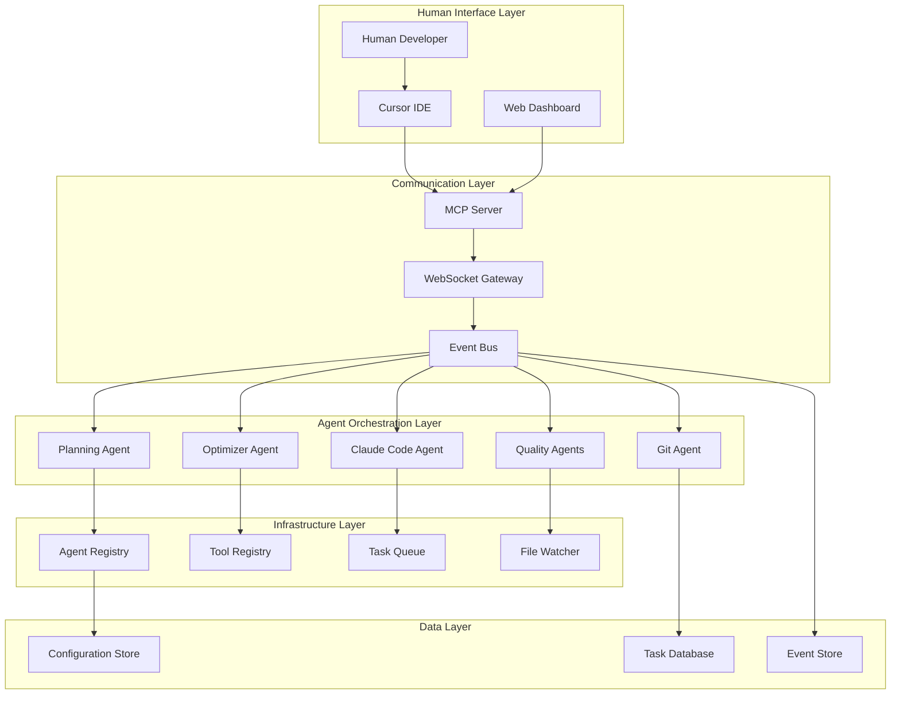

## 🔄 Data Flow Architecture

### Task Processing Flow
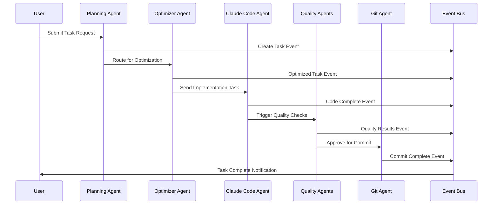

## 🧠 Agent Interaction Patterns

### Agent Communication Matrix
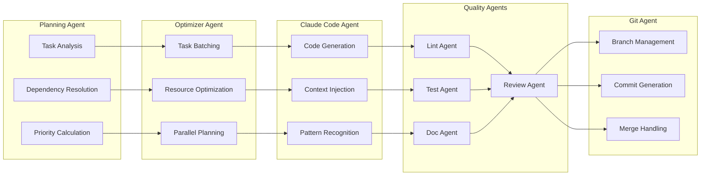

## 📊 Task Lifecycle States

### Task State Machine
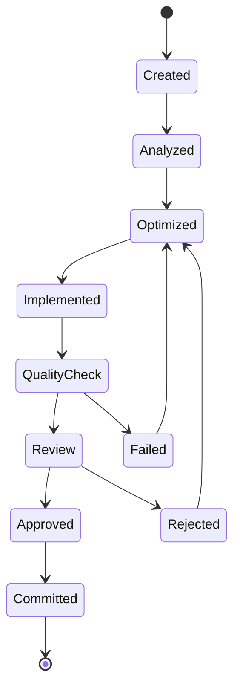

## 🎯 Orchestration Patterns

### Sequential Quality Gate Pattern
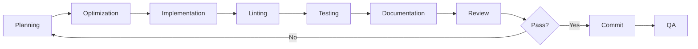

### Parallel Quality Check Pattern
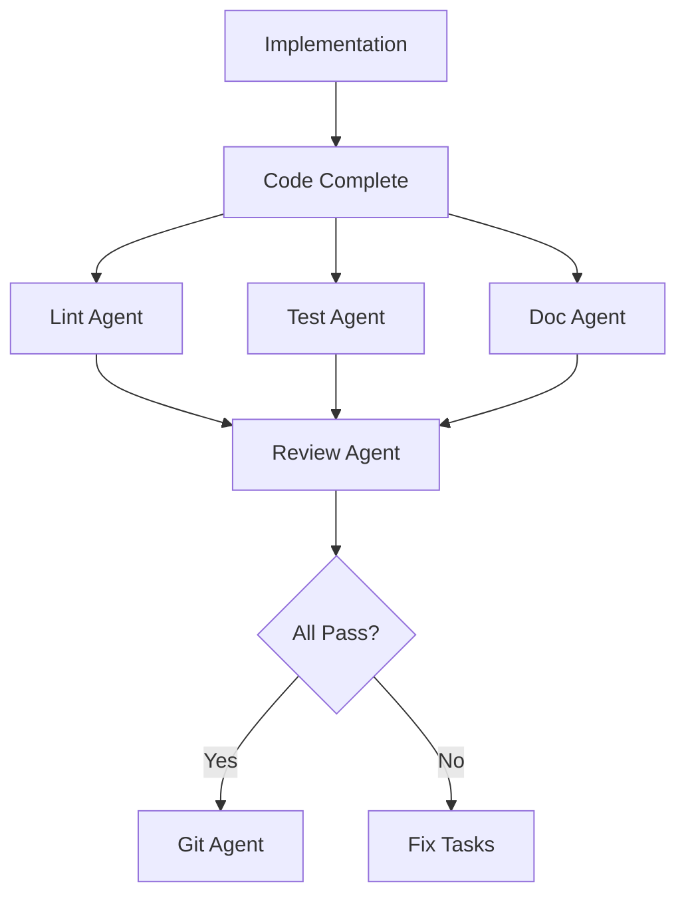

### Fail-Fast Pattern
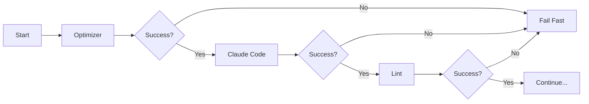

## 📈 Performance Metrics Dashboard

### Quality Metrics Overview
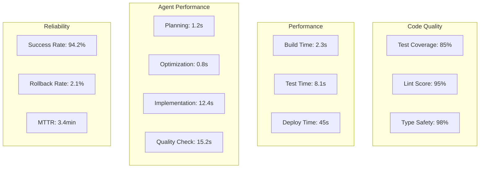

## 🔧 Component Dependencies

### Module Dependency Graph
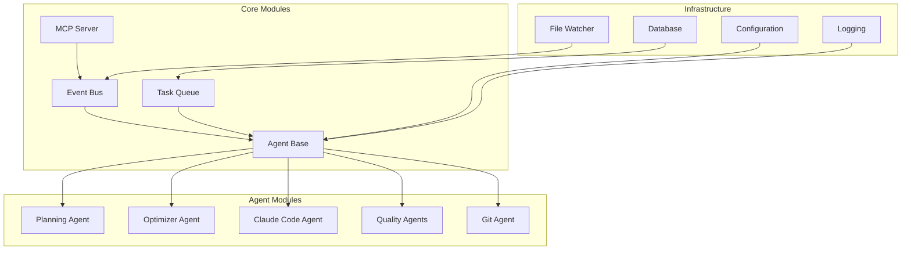

## 🚀 Deployment Architecture

### Production Deployment
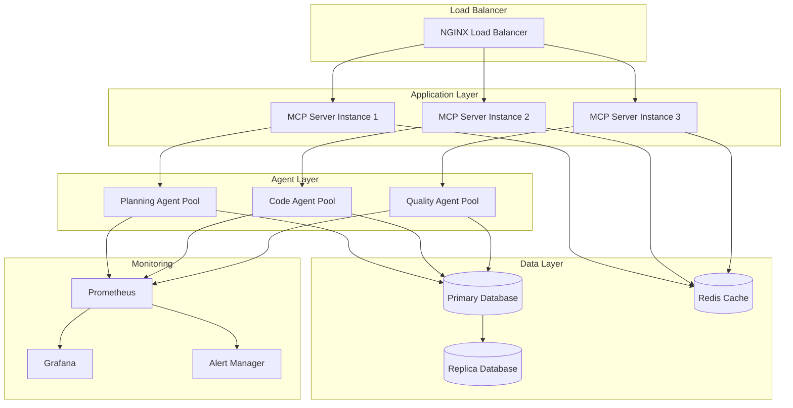

## 📋 Task Queue Management

### Priority Queue Structure
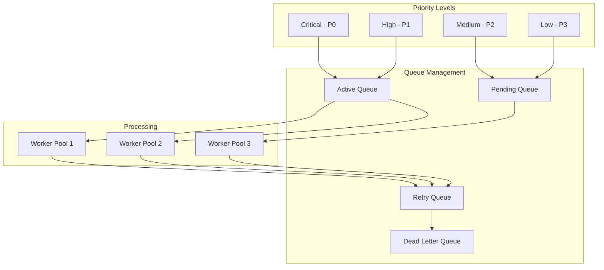

## 🔄 Event Flow Architecture

### Event-Driven Architecture
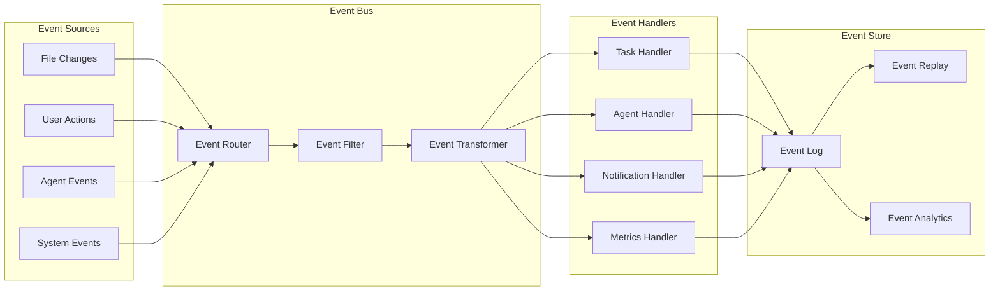

## 🎨 User Interface Flow

### Cursor IDE Integration Flow
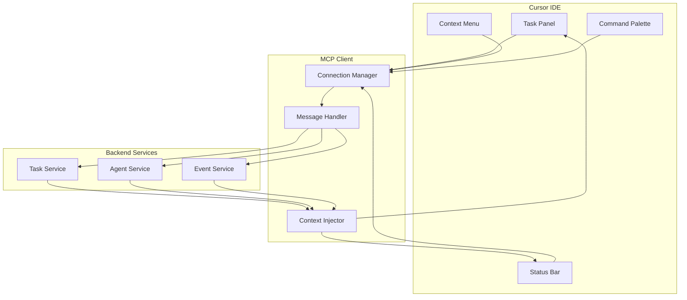

## 📊 Monitoring & Observability

### Observability Stack
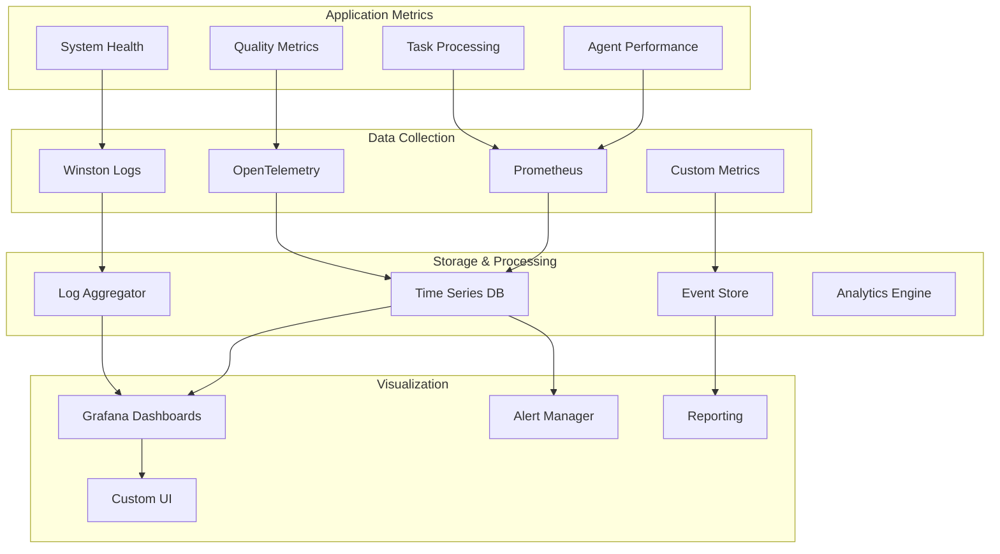

## 🔐 Security Architecture

### Security Layers
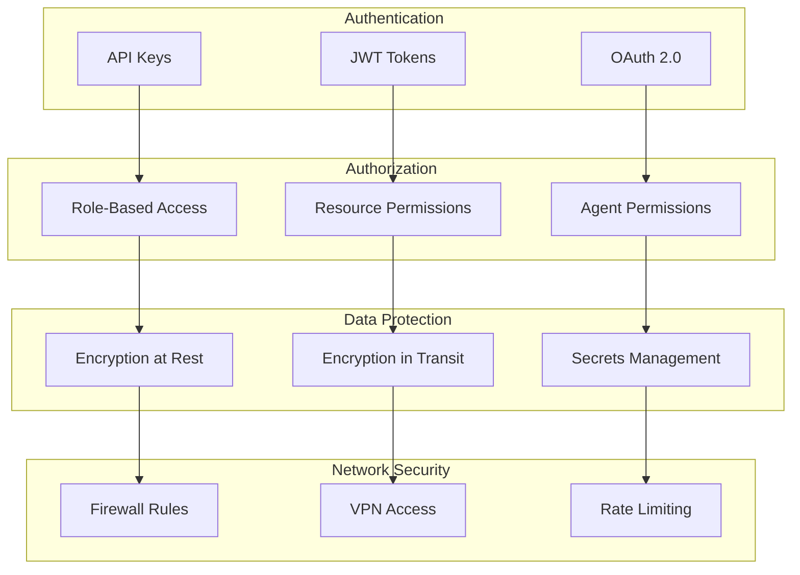

## 📈 Performance Optimization

### Performance Bottlenecks & Solutions
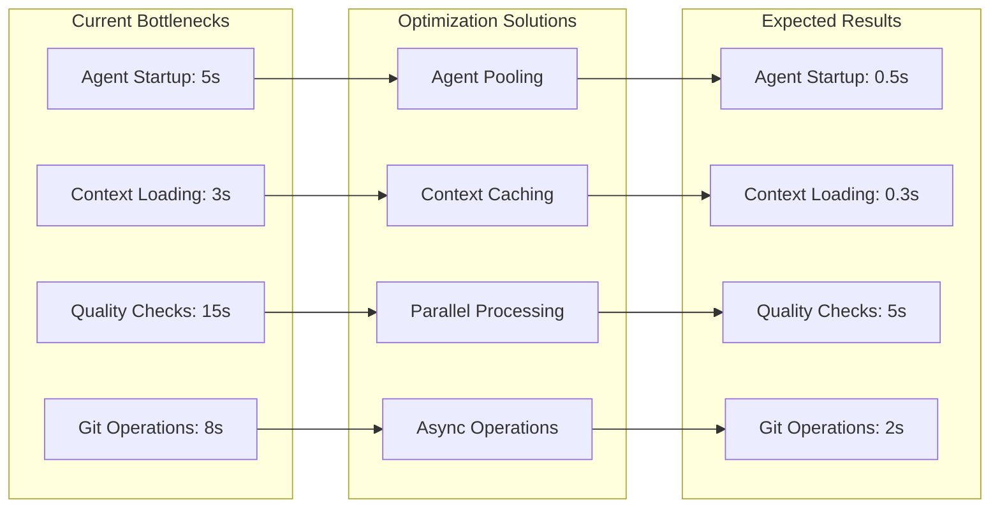

---

## 📝 Diagram Usage Notes

### For Notion Integration:
1. Copy any mermaid diagram
2. Create a code block in Notion
3. Set language to "mermaid"
4. Paste the diagram code

### For Documentation:
- Use these diagrams in README.md
- Include in technical specifications
- Reference in architecture decisions
- Use for onboarding new developers

### For Presentations:
- Export as PNG/SVG for slides
- Use in project proposals
- Include in stakeholder updates
- Reference in technical reviews 