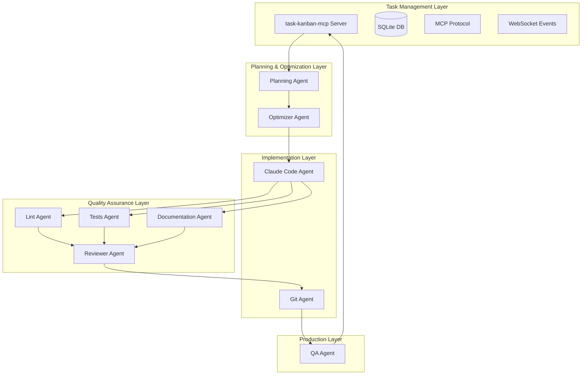
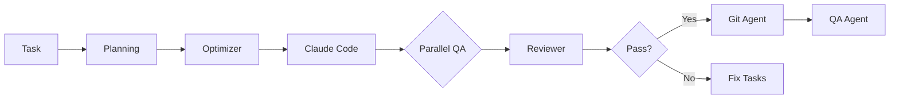

# Autonomous Development Pipeline - Master Product Requirements Document

## Executive Summary

The Autonomous Development Pipeline is a comprehensive system of AI-powered agents that work together to create a self-sustaining software development ecosystem. Built on top of the task-kanban-mcp infrastructure, this pipeline automates the entire software development lifecycle from task planning through implementation, quality assurance, and deployment. By orchestrating specialized agents that handle different aspects of development, the system enables continuous delivery of high-quality software with minimal human intervention.

### Vision

Transform software development from a human-intensive process to an AI-orchestrated pipeline where:
- **AI agents handle implementation** while humans focus on architecture and strategy
- **Quality is automatically maintained** through continuous checking and self-healing
- **Documentation stays current** without manual effort
- **The codebase improves continuously** through automated optimization

### Key Value Propositions

1. **10x Development Velocity**: Parallel agent execution with 24/7 operation
2. **Consistent Quality**: Every change passes through multiple quality gates
3. **Zero Documentation Debt**: Automatic documentation generation and updates
4. **Self-Healing Pipeline**: Issues are detected and fixed automatically
5. **Human Empowerment**: Developers focus on high-level design and innovation

## System Overview

### Architecture



### Agent Ecosystem

| Agent | Purpose | Triggers | Outputs |
|-------|---------|----------|---------|
| **Planning Agent** | Monitors tasks, analyzes dependencies, creates optimal queue | Continuous monitoring | Prioritized task queue |
| **Optimizer Agent** | Breaks down complex tasks, batches small ones | New tasks in queue | Optimized tasks |
| **Claude Code Agent** | Implements code changes autonomously | Optimized tasks ready | Code commits to feature branch |
| **Lint Agent** | Analyzes code quality and security | Code changes | Fix tasks for issues |
| **Tests Agent** | Runs test suites and coverage analysis | Code changes | Test failure tasks |
| **Documentation Agent** | Identifies and fills documentation gaps | Code changes | Documentation tasks |
| **Reviewer Agent** | Aggregates quality checks and makes merge decisions | All quality agents complete | Pass/fail decision + fix tasks |
| **Git Agent** | Manages version control with intelligent commits | Quality gates passed | Commits, branches, merges |
| **QA Agent** | Runs user flow testing on main branch | Main branch merges | Bug tasks for issues |

## Core Components

### 1. Task-Kanban-MCP Integration

All agents integrate natively with the existing task-kanban-mcp system:

```typescript
interface MCPAgentBase {
  // Core MCP connection
  mcpServerUrl: string;
  apiKey: string;
  
  // Standard MCP tools
  tools: {
    getTasks(filter: TaskFilter): Promise<Task[]>;
    createTask(task: TaskData): Promise<Task>;
    updateTask(id: number, updates: Partial<Task>): Promise<Task>;
    subscribeToEvents(handler: EventHandler): void;
  };
  
  // Agent-specific tools
  agentTools: Record<string, MCPTool>;
}
```

### 2. Planning & Task Management

#### Planning Agent
- **Continuous Monitoring**: Polls task-kanban-mcp every 30 seconds
- **Dependency Resolution**: Builds directed acyclic graph of task relationships
- **Priority Calculation**: Multi-factor scoring (business value, technical importance, effort, time)
- **Queue Optimization**: Orders tasks for maximum throughput

```typescript
interface PlanningStrategy {
  businessValueWeight: 0.4;
  technicalImportanceWeight: 0.3;
  effortEfficiencyWeight: 0.2;
  timeSensitivityWeight: 0.1;
}
```

#### Optimizer Agent
- **Task Analysis**: Evaluates complexity and requirements
- **Smart Decomposition**: Breaks tasks into <2 hour subtasks
- **Intelligent Batching**: Combines related small tasks
- **Context Enhancement**: Adds missing specifications

### 3. Implementation Layer

#### Claude Code Agent
- **Autonomous Coding**: Implements tasks without human intervention
- **Pattern Recognition**: Follows project conventions
- **Multi-Language Support**: Handles any programming language
- **Context Awareness**: Understands project architecture

```typescript
interface ImplementationCapabilities {
  languages: ["javascript", "typescript", "python", "java", "go", "rust", "more..."];
  frameworks: ["react", "vue", "django", "spring", "express", "more..."];
  patterns: ["mvc", "microservices", "event-driven", "ddd", "more..."];
}
```

#### Git Agent
- **Intelligent Commits**: Generates exhaustive commit messages
- **Branch Management**: Creates, merges, and cleans branches
- **History Optimization**: Maintains clean, meaningful history
- **Quality Gates**: Only commits after all checks pass

### 4. Quality Assurance Layer

#### Parallel Quality Agents
All quality agents run in parallel after code changes:

**Lint Agent**
- Multi-tool orchestration (ESLint, Pylint, etc.)
- Claude-powered intelligent analysis
- Security vulnerability detection
- Architecture and design pattern checking

**Tests Agent**
- Multi-framework support (Jest, Pytest, JUnit, etc.)
- Coverage enforcement
- Performance regression detection
- Flaky test identification

**Documentation Agent**
- Gap detection at all levels (function, class, module, project)
- Multi-format support (docstrings, README, API docs)
- Quality assessment
- Template generation

#### Reviewer Agent
- **Aggregation**: Consolidates findings from all quality agents
- **Decision Making**: Intelligent pass/fail determination
- **Task Generation**: Creates specific fix tasks for failures
- **Learning System**: Improves decisions over time

### 5. Production Validation

#### QA Agent
- **User Flow Testing**: Validates real user journeys
- **Cross-Browser Testing**: Ensures compatibility
- **Visual Regression**: Detects UI changes
- **Performance Monitoring**: Tracks speed and resources

## Orchestration Patterns

The system supports 25+ orchestration patterns for different scenarios:

### Primary Patterns

#### 1. Standard Development Flow


#### 2. Critical Production Pattern
- Sequential quality gates
- Consensus decision making
- Staged rollback capability
- Canary deployment

#### 3. Rapid Development Pattern
- Parallel execution
- Fail-fast on errors
- Batch processing
- Resource pooling

### Pattern Selection Matrix

| Scenario | Recommended Pattern | Agents Used | Quality Level |
|----------|-------------------|-------------|---------------|
| Hotfix | Fail-Fast + Priority | Core only | Essential |
| Feature | Parallel + Full QA | All agents | High |
| Refactor | Batch + Regression | All + extra tests | Maximum |
| Experiment | Speculative + Shadow | Subset | Moderate |

## Implementation Requirements

### 1. Technical Infrastructure

```yaml
infrastructure:
  servers:
    task_kanban_mcp:
      type: "MCP Server"
      database: "SQLite"
      api: "REST + WebSocket"
      
  agents:
    runtime: "Node.js 18+"
    language: "TypeScript"
    frameworks:
      - "Express.js"
      - "Socket.io"
      - "Commander.js"
      
  ai_services:
    claude:
      model: "claude-3-opus"
      context_window: 200000
      rate_limit: 1000/min
```

### 2. Integration Points

```typescript
interface AgentIntegrations {
  // MCP Protocol
  mcp: {
    tools: MCPTool[];
    events: EventSubscription[];
  };
  
  // Git Integration
  git: {
    hooks: GitHook[];
    credentials: GitCredentials;
  };
  
  // CI/CD Integration
  cicd: {
    webhooks: Webhook[];
    deploymentAPI: DeploymentInterface;
  };
  
  // Monitoring
  monitoring: {
    metrics: MetricCollector;
    logs: LogAggregator;
    alerts: AlertManager;
  };
}
```

### 3. Security Requirements

- **API Key Management**: Secure storage and rotation
- **Git Credentials**: Encrypted storage
- **Claude API**: No code retention policy
- **Access Control**: Role-based permissions
- **Audit Trail**: Complete operation logging

## Performance Specifications

### Agent Performance Targets

| Agent | Latency | Throughput | Resource Usage |
|-------|---------|------------|----------------|
| Planning | <5s per analysis | 1000 tasks/min | <200MB RAM |
| Optimizer | <5s per task | 100 tasks/min | <500MB RAM |
| Claude Code | <30s per task | 20 tasks/hour | <1GB RAM |
| Lint | <30s per 100 files | 10 repos/hour | <500MB RAM |
| Tests | Varies | 100 suites/hour | <2GB RAM |
| Documentation | <20s per 1000 files | 5 repos/hour | <300MB RAM |
| Reviewer | <60s per review | 50 reviews/hour | <500MB RAM |
| Git | <5s per operation | 100 ops/min | <200MB RAM |
| QA | <5min per flow | 20 flows/hour | <1GB RAM |

### System-Wide Metrics

- **End-to-End Latency**: Task creation to deployment <1 hour
- **Throughput**: 100+ tasks/day per pipeline
- **Availability**: 99.9% uptime
- **Quality Gate Pass Rate**: >85% first attempt
- **Auto-Fix Success Rate**: >70% of issues

## Deployment Architecture

### 1. Development Environment
```yaml
development:
  deployment: "Docker Compose"
  agents: "All in single host"
  database: "Local SQLite"
  monitoring: "Basic logging"
```

### 2. Production Environment
```yaml
production:
  deployment: "Kubernetes"
  agents: "Distributed pods"
  database: "PostgreSQL cluster"
  monitoring: "Full observability stack"
  scaling: "Horizontal auto-scaling"
```

### 3. Monitoring & Observability

```typescript
interface ObservabilityStack {
  metrics: {
    provider: "Prometheus";
    dashboards: "Grafana";
    alerts: "AlertManager";
  };
  
  logs: {
    aggregator: "Loki";
    viewer: "Grafana";
    retention: "30 days";
  };
  
  traces: {
    collector: "OpenTelemetry";
    backend: "Jaeger";
    sampling: "1%";
  };
}
```

## Success Metrics & KPIs

### Primary Metrics

1. **Development Velocity**
   - Target: 10x improvement over manual development
   - Measurement: Tasks completed per day

2. **Code Quality**
   - Target: <2% bug escape rate
   - Measurement: Production issues per deployment

3. **Documentation Coverage**
   - Target: 100% of public APIs documented
   - Measurement: Documentation coverage tools

4. **Test Coverage**
   - Target: >80% code coverage maintained
   - Measurement: Coverage reports

5. **Deployment Frequency**
   - Target: Multiple deployments per day
   - Measurement: Deployment pipeline metrics

### Operational Metrics

- **Agent Utilization**: >70% active time
- **Task Queue Depth**: <50 tasks backlog
- **Quality Gate Pass Rate**: >85%
- **Mean Time to Resolution**: <30 minutes
- **System Availability**: 99.9% uptime

## Implementation Roadmap

### Phase 1: Foundation (Months 1-2)
- Deploy task-kanban-mcp infrastructure
- Implement Planning and Optimizer agents
- Basic Claude Code agent
- Simple orchestration patterns

### Phase 2: Quality Layer (Months 3-4)
- Deploy Lint, Tests, Documentation agents
- Implement Reviewer agent
- Add parallel orchestration
- Quality gate integration

### Phase 3: Automation (Months 5-6)
- Git agent with full capabilities
- QA agent for production testing
- Advanced orchestration patterns
- Self-healing capabilities

### Phase 4: Scale & Optimize (Months 7-8)
- Multi-project support
- Performance optimization
- Advanced monitoring
- ML-based improvements

### Phase 5: Enterprise Features (Months 9-12)
- Multi-tenant support
- Advanced security features
- Compliance automation
- Custom agent development

## Risk Analysis & Mitigation

### Technical Risks

| Risk | Impact | Probability | Mitigation |
|------|--------|-------------|------------|
| AI hallucination | High | Medium | Multiple validation layers |
| System complexity | High | High | Modular architecture, gradual rollout |
| Performance bottlenecks | Medium | Medium | Horizontal scaling, caching |
| Integration failures | Medium | Low | Circuit breakers, fallbacks |

### Operational Risks

| Risk | Impact | Probability | Mitigation |
|------|--------|-------------|------------|
| Runaway automation | High | Low | Kill switches, monitoring |
| Quality degradation | High | Medium | Continuous metrics, gates |
| Resource costs | Medium | Medium | Usage limits, optimization |
| Team resistance | Medium | Medium | Gradual adoption, training |

## Cost Analysis

### Infrastructure Costs (Monthly)
- **Compute**: $2,000-5,000 (depending on scale)
- **AI API Costs**: $3,000-8,000 (Claude API usage)
- **Storage**: $500-1,000
- **Monitoring**: $500-1,000
- **Total**: $6,000-15,000

### ROI Calculation
- **Developer Hour Saved**: 160 hours/month
- **Developer Cost**: $100/hour average
- **Monthly Savings**: $16,000
- **ROI**: 2-3 months

## Conclusion

The Autonomous Development Pipeline represents a paradigm shift in software development, transforming it from a manual, error-prone process to an intelligent, self-improving system. By combining specialized AI agents with robust orchestration patterns and comprehensive quality gates, we create a development environment where:

- **Code quality is guaranteed** through multiple validation layers
- **Documentation is always current** through continuous generation
- **Deployment is continuous** yet safe through intelligent automation
- **Developers are empowered** to focus on architecture and innovation

This system is not just an incremental improvement—it's a fundamental reimagining of how software can be built in the age of AI. The modular architecture ensures that organizations can adopt it gradually, proving value at each step while building toward a fully autonomous development future.

## Appendix A: Agent Specifications Summary

| Agent | Language | Primary Dependencies | MCP Tools | Key Metrics |
|-------|----------|---------------------|-----------|-------------|
| Planning | TypeScript | task-kanban-mcp | 4 tools | Queue optimization |
| Optimizer | TypeScript | Claude API | 4 tools | Task reduction |
| Claude Code | TypeScript | Claude CLI | 5 tools | Implementation success |
| Lint | TypeScript | ESLint, Pylint, etc | 4 tools | Issue detection |
| Tests | TypeScript | Jest, Pytest, etc | 5 tools | Test coverage |
| Documentation | TypeScript | AST parsers | 4 tools | Doc coverage |
| Reviewer | TypeScript | All agents | 3 tools | Decision accuracy |
| Git | TypeScript | Git CLI | 5 tools | Commit quality |
| QA | TypeScript | Playwright, etc | 4 tools | Bug detection |

## Appendix B: Configuration Templates

### Master Configuration
```yaml
pipeline:
  name: "Autonomous Development Pipeline"
  version: "1.0.0"
  
  task_management:
    server: "http://localhost:3000"
    api_key: "${TASK_KANBAN_API_KEY}"
    
  orchestration:
    default_pattern: "parallel_quality_check"
    quality_gates:
      enforce: true
      threshold: 0.95
      
  agents:
    planning:
      enabled: true
      poll_interval: 30s
      
    optimizer:
      enabled: true
      max_task_size: 2h
      
    claude_code:
      enabled: true
      model: "claude-3-opus"
      
    quality:
      parallel: true
      timeout: 5m
      
    git:
      enabled: true
      quality_gate_required: true
      
  monitoring:
    metrics: true
    logs: true
    alerts: true
```

## Appendix C: Orchestration Pattern Reference

See the comprehensive [Agent Orchestration Patterns](#agent-orchestration-patterns) document for detailed patterns including:

1. Sequential Quality Gate
2. Parallel Quality Check
3. Fail-Fast
4. Continuous Integration
5. Batch Processing
6. Priority-Based
7. Speculative Execution
8. Canary Deployment
9. Self-Healing
10. Consensus
11. Pipeline Branch
12. Feedback Loop
13. Resource Pool
14. Circuit Breaker
15. Staged Rollback
16. Predictive
17. Monitoring-Driven
18. Dependency-Aware
19. Time-Box
20. A/B Testing
21. Event-Driven
22. Saga
23. Micro-Batch
24. Shadow Mode
25. Hierarchical

Each pattern includes implementation details, use cases, and selection criteria.