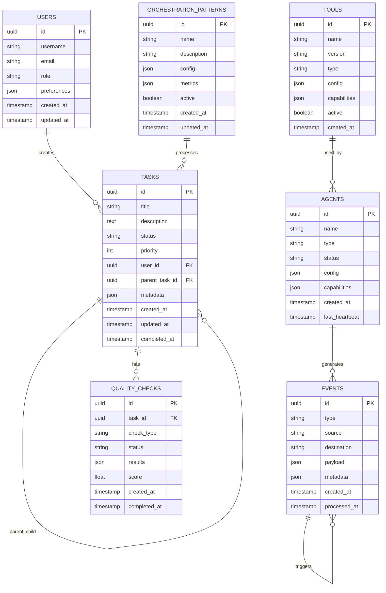
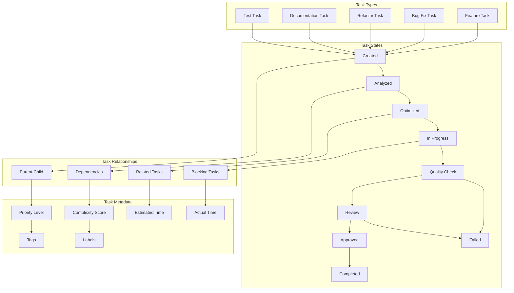
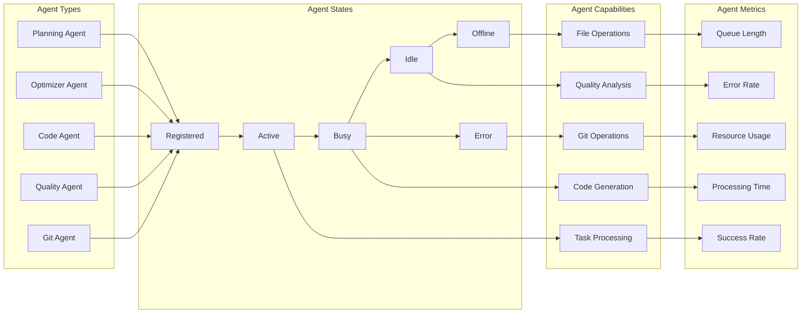
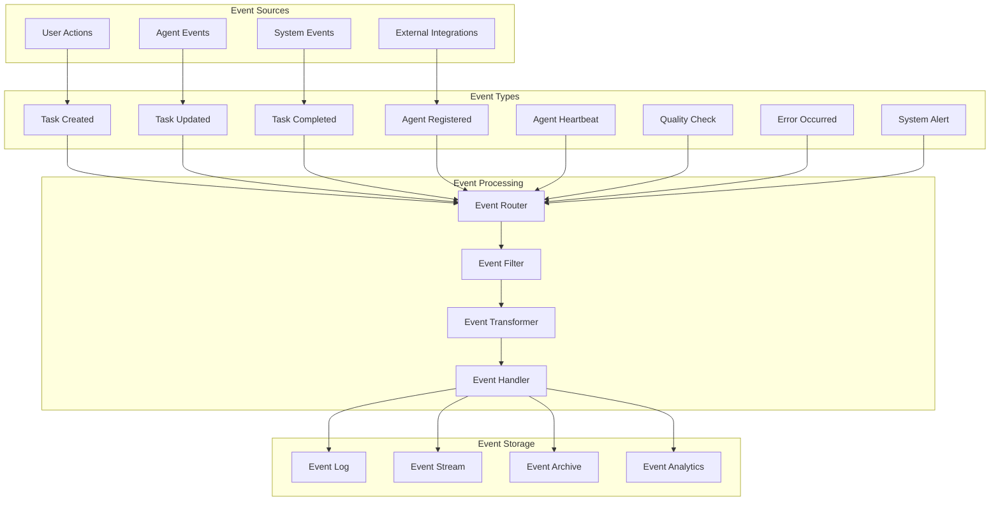
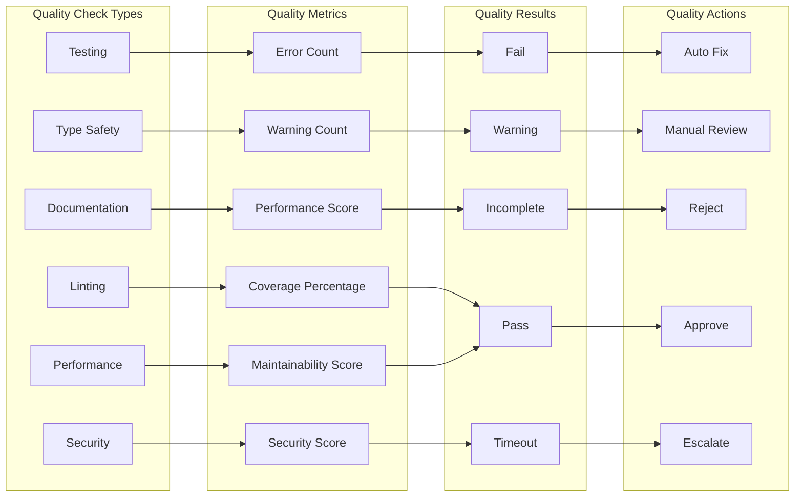
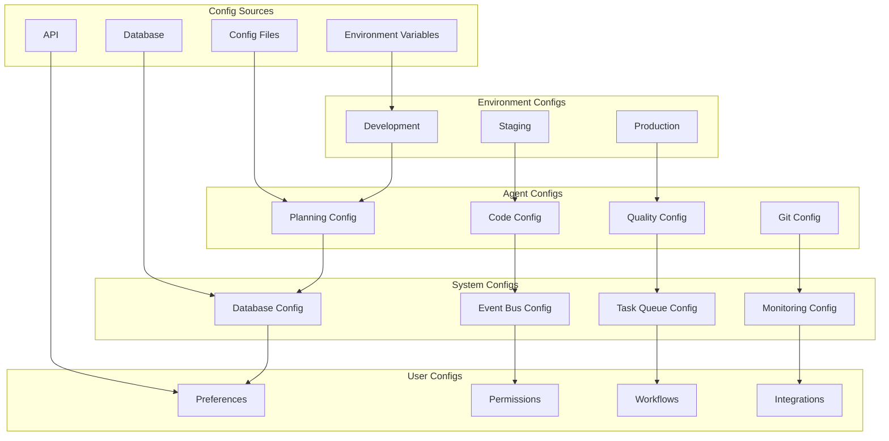
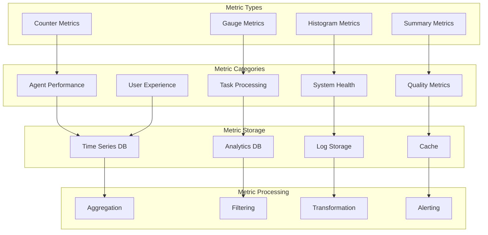
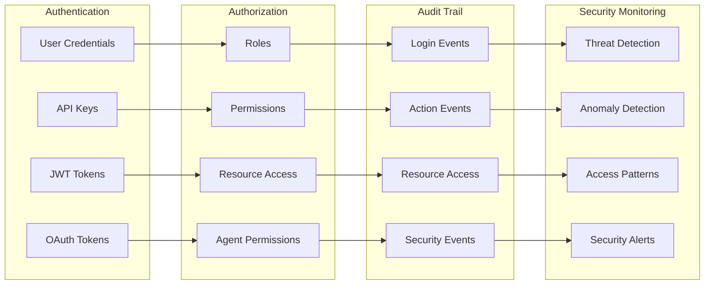
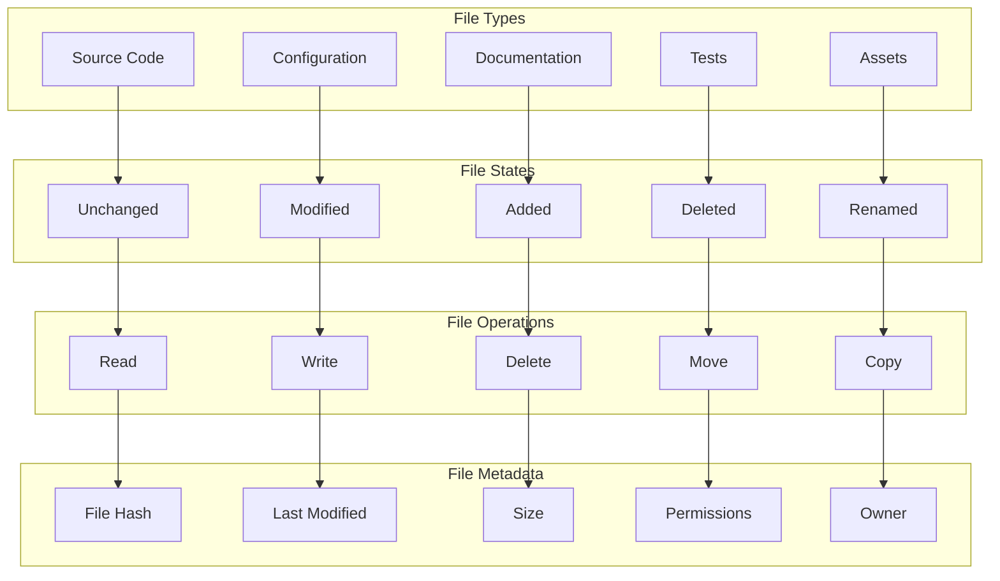
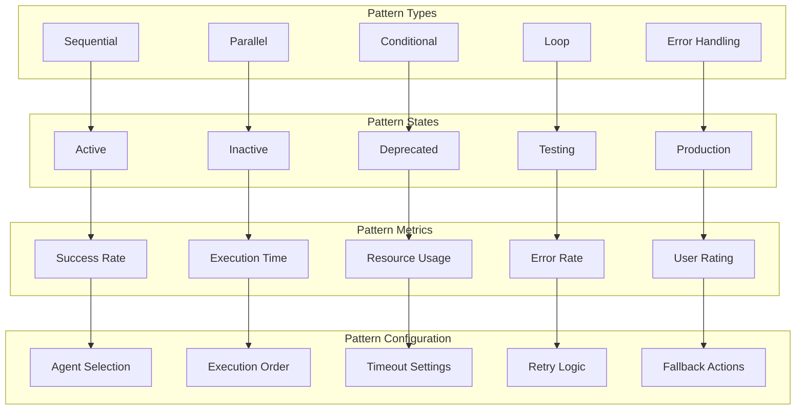

# Data Model Diagrams

## 🗄️ Database Schema Overview

### Core Entity Relationship Diagram

## 📊 Task Management Data Model

### Task Hierarchy and Dependencies

## 🧠 Agent Data Model

### Agent Registry and Capabilities

## 🔄 Event Data Model

### Event Types and Flow

## 🎯 Quality Assurance Data Model

### Quality Metrics and Results

## 🔧 Configuration Data Model

### Configuration Hierarchy

## 📈 Metrics and Analytics Data Model

### Performance Metrics Structure

## 🔐 Security Data Model

### Authentication and Authorization

## 🗂️ File System Data Model

### File and Directory Structure

## 🔄 Workflow Data Model

### Orchestration Pattern Data

---

## 📝 Data Model Usage Notes

### For Database Design:
- Use these diagrams to design database schemas
- Reference for creating migration scripts
- Include in database documentation
- Use for performance optimization

### For API Design:
- Reference for API endpoint design
- Use for request/response schemas
- Include in API documentation
- Use for validation rules

### For Development:
- Use for understanding data relationships
- Reference during code implementation
- Include in technical specifications
- Use for testing data scenarios

### For Operations:
- Use for database monitoring
- Reference for backup strategies
- Include in disaster recovery plans
- Use for capacity planning 