# Development Workflow Diagrams

## 🔄 Complete Development Lifecycle

### End-to-End Development Flow
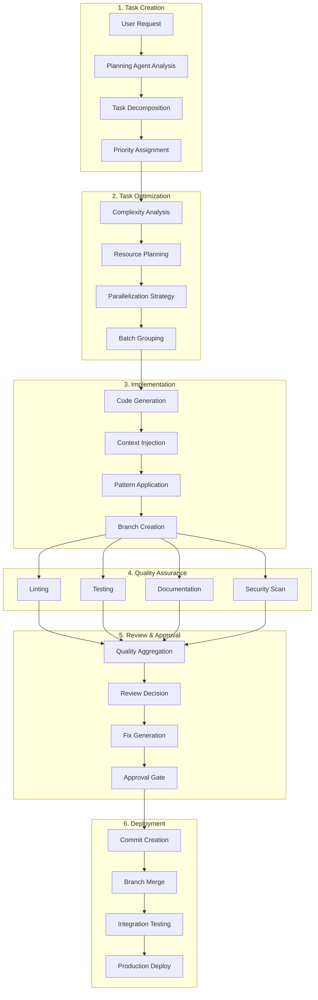

## 🧠 Agent Decision Flow

### Agent Decision Tree
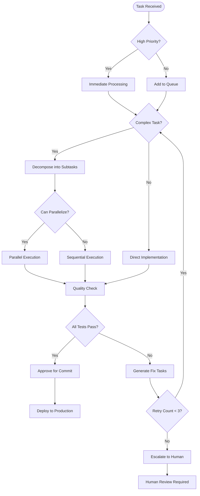

## 🎯 Quality Gate Flow

### Quality Gate Decision Matrix
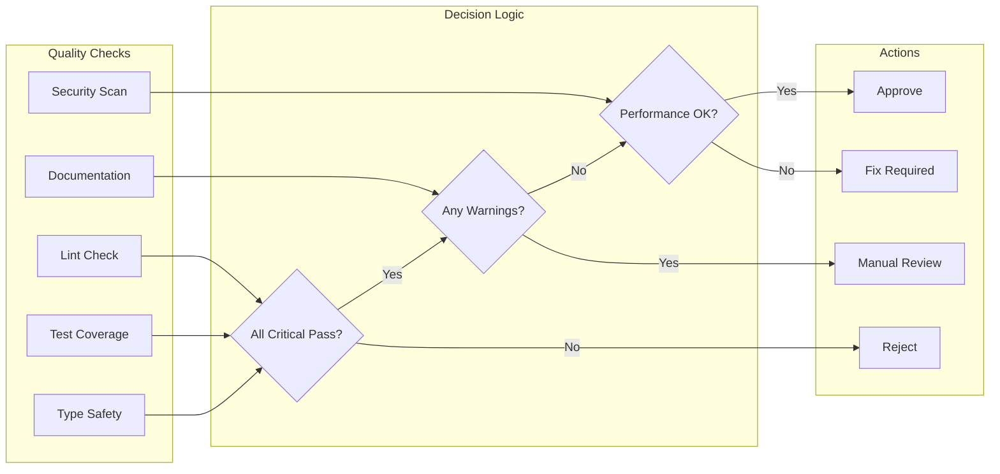

## 🔄 Error Handling & Recovery

### Error Recovery Flow
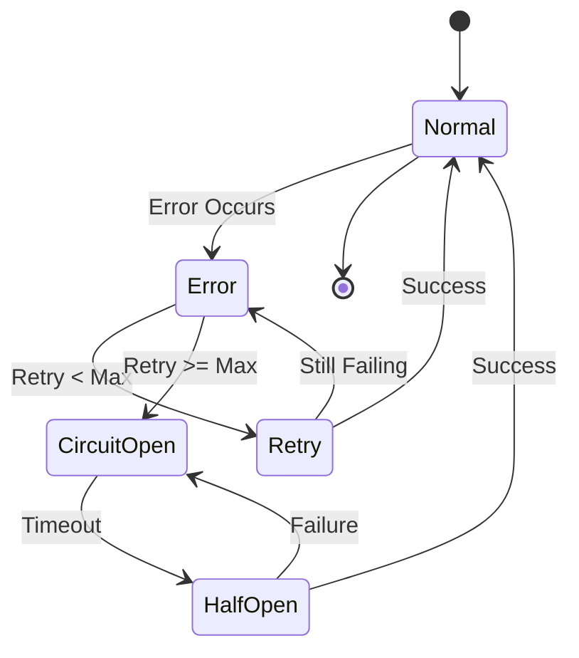

## 📊 Performance Monitoring Flow

### Performance Metrics Collection
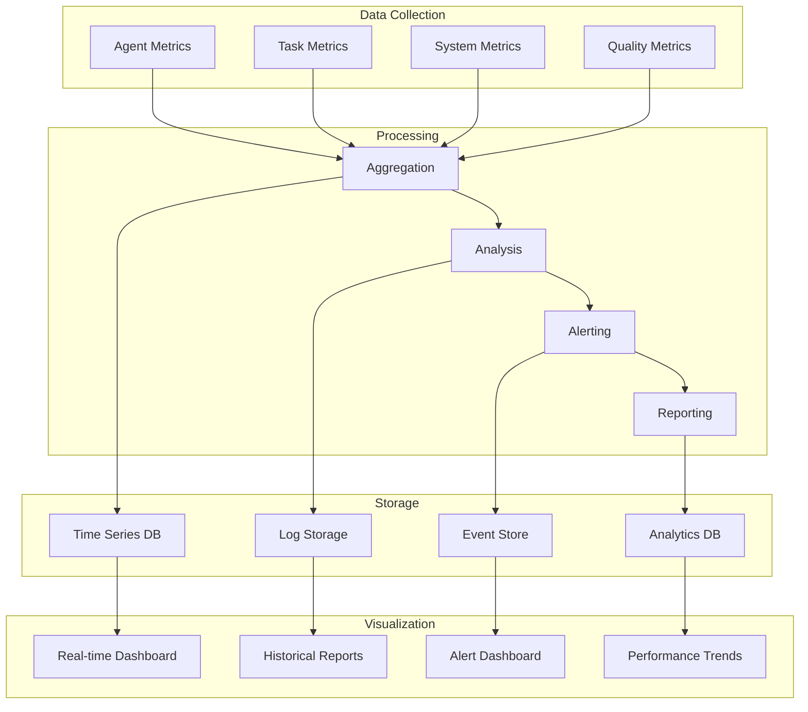

## 🔧 Configuration Management Flow

### Configuration Hierarchy
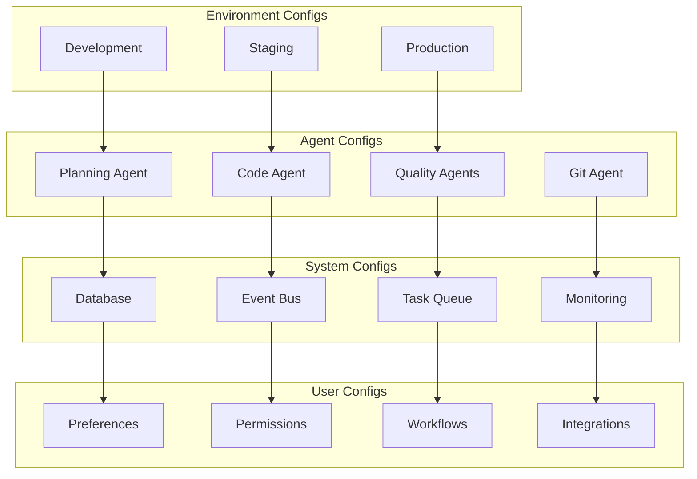

## 🚀 Deployment Pipeline

### CI/CD Pipeline Flow
```mermaid
graph LR
    subgraph "Source Control"
        SC1[Code Commit]
        SC2[Branch Creation]
        SC3[Pull Request]
    end
    
    subgraph "Build & Test"
        BT1[Code Build]
        BT2[Unit Tests]
        BT3[Integration Tests]
        BT4[Quality Checks]
    end
    
    subgraph "Deployment"
        DP1[Staging Deploy]
        DP2[Staging Tests]
        DP3[Production Deploy]
        DP4[Production Tests]
    end
    
    subgraph "Monitoring"
        MN1[Health Checks]
        MN2[Performance Monitoring]
        MN3[Error Tracking]
        MN4[User Feedback]
    end
    
    SC1 --> SC2 --> SC3
    SC3 --> BT1 --> BT2 --> BT3 --> BT4
    BT4 --> DP1 --> DP2 --> DP3 --> DP4
    DP4 --> MN1 --> MN2 --> MN3 --> MN4
```

## 🔄 Rollback Strategy

### Rollback Decision Flow
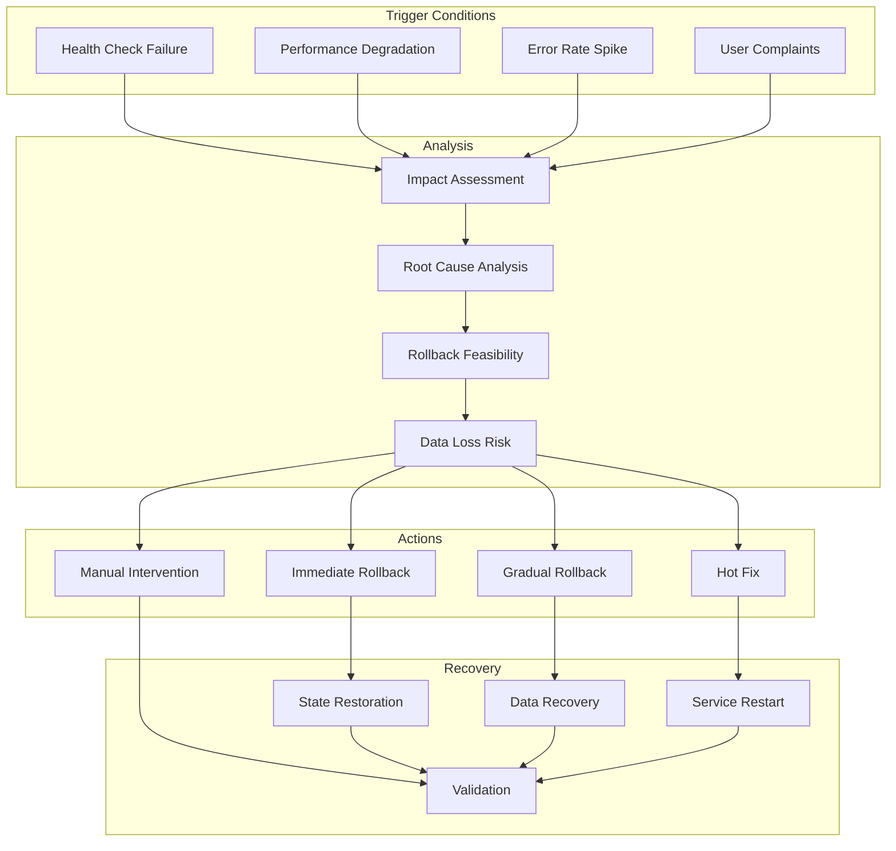

## 📈 Scaling Strategy

### Horizontal Scaling Flow
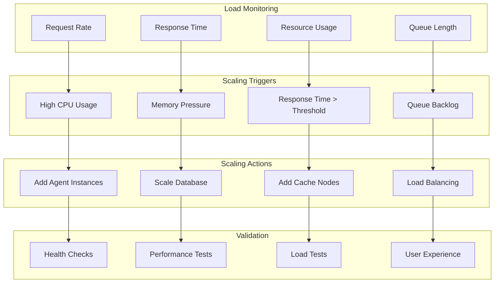

## 🔐 Security Flow

### Security Validation Flow
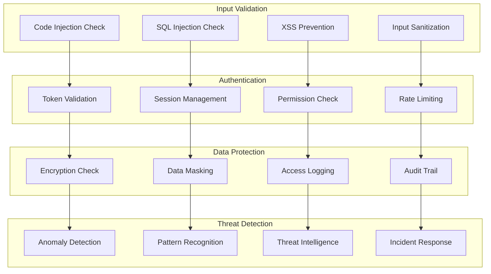

## 🎨 User Experience Flow

### User Interaction Flow
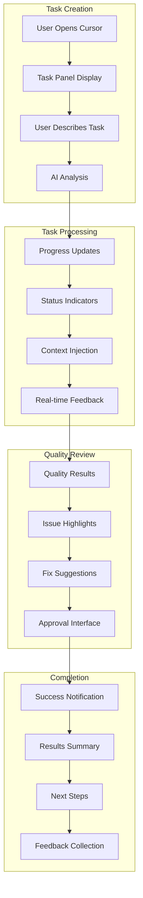

---

## 📝 Workflow Usage Notes

### For Development Teams:
- Use these diagrams to understand the complete development process
- Reference during code reviews and architecture discussions
- Include in onboarding materials for new team members
- Use for process optimization and improvement

### For Stakeholders:
- Share high-level flows for project understanding
- Use in presentations and status updates
- Reference for timeline and milestone planning
- Include in project documentation

### For Operations:
- Use deployment and scaling diagrams for infrastructure planning
- Reference security flows for compliance requirements
- Include monitoring flows in operational procedures
- Use rollback strategies for incident response 