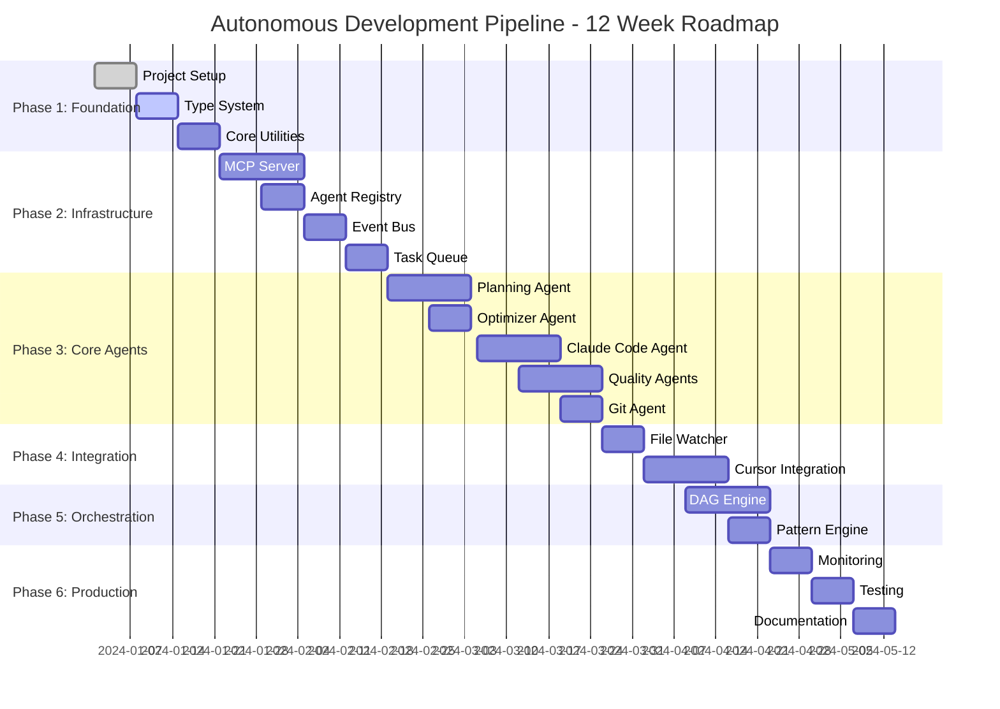
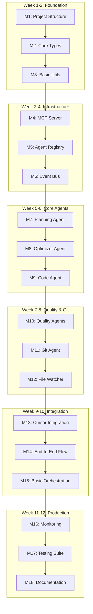
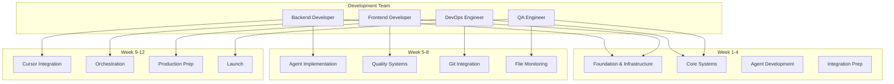
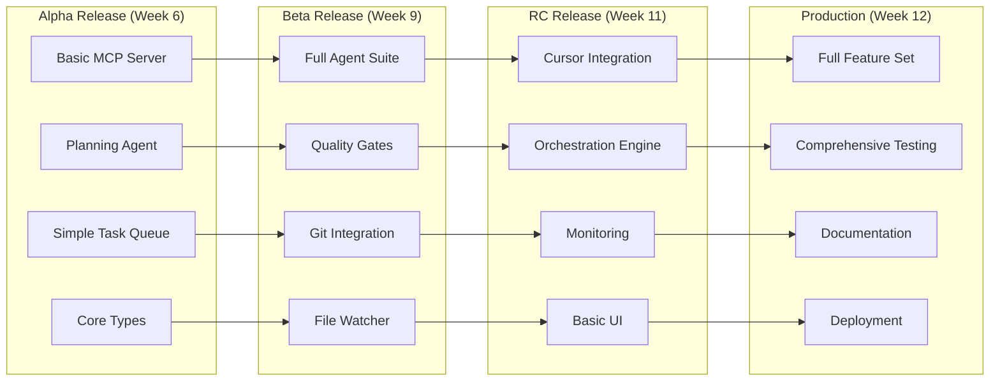
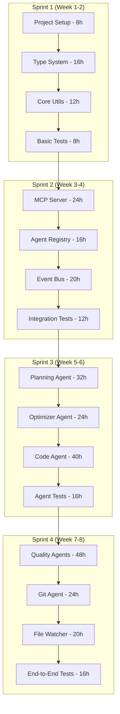
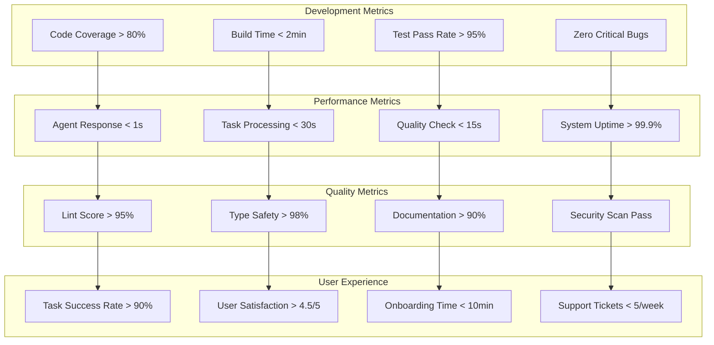
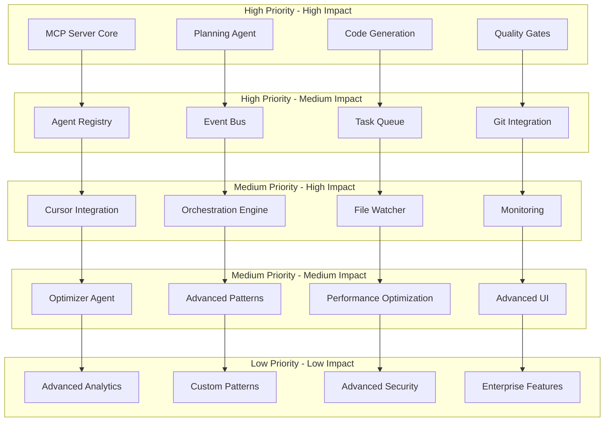
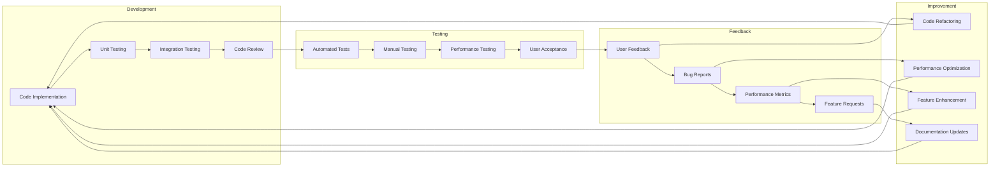

# Project Roadmap Diagrams

## 🗓️ Project Timeline Overview

### 12-Week Development Roadmap

## 🎯 Milestone Tracking

### Project Milestones and Deliverables

## 📊 Resource Allocation

### Team and Resource Planning

## 🚀 Release Strategy

### Release Phases and Features

## 📈 Progress Tracking

### Sprint Burndown and Velocity

## 🎯 Risk Management

### Risk Assessment and Mitigation

```mermaid
graph TD
    subgraph "High Risk"
        HR1[Claude API Integration]
        HR2[Cursor Plugin Development]
        HR3[Complex Orchestration Logic]
        HR4[Performance at Scale]
    end
    
    subgraph "Medium Risk"
        MR1[Agent Communication]
        MR2[File System Monitoring]
        MR3[Quality Gate Logic]
        MR4[Error Recovery]
    end
    
    subgraph "Low Risk"
        LR1[Basic Infrastructure]
        LR2[Type System Design]
        LR3[Configuration Management]
        LR4[Documentation]
    end
    
    subgraph "Mitigation Strategies"
        MS1[Early Prototyping]
        MS2[Incremental Development]
        MS3[Comprehensive Testing]
        MS4[Performance Monitoring]
        MS5[Fallback Mechanisms]
    end
    
    HR1 --> MS1
    HR2 --> MS1
    HR3 --> MS2
    HR4 --> MS4
    
    MR1 --> MS2
    MR2 --> MS3
    MR3 --> MS3
    MR4 --> MS5
    
    LR1 --> MS2
    LR2 --> MS2
    LR3 --> MS2
    LR4 --> MS3
```

## 🔄 Iteration Planning

### Development Iterations

```mermaid
graph LR
    subgraph "Iteration 1: Foundation"
        I1_1[Project Structure]
        I1_2[Core Types]
        I1_3[Basic Utils]
        I1_4[Simple Tests]
    end
    
    subgraph "Iteration 2: Infrastructure"
        I2_1[MCP Server]
        I2_2[Agent Registry]
        I2_3[Event Bus]
        I2_4[Task Queue]
    end
    
    subgraph "Iteration 3: Core Agents"
        I3_1[Planning Agent]
        I3_2[Optimizer Agent]
        I3_3[Code Agent]
        I3_4[Agent Tests]
    end
    
    subgraph "Iteration 4: Quality & Git"
        I4_1[Quality Agents]
        I4_2[Git Agent]
        I4_3[File Watcher]
        I4_4[Integration Tests]
    end
    
    subgraph "Iteration 5: Integration"
        I5_1[Cursor Integration]
        I5_2[Orchestration Engine]
        I5_3[End-to-End Flow]
        I5_4[User Testing]
    end
    
    subgraph "Iteration 6: Production"
        I6_1[Monitoring]
        I6_2[Performance Optimization]
        I6_3[Documentation]
        I6_4[Deployment]
    end
    
    I1_1 --> I1_2 --> I1_3 --> I1_4
    I1_4 --> I2_1 --> I2_2 --> I2_3 --> I2_4
    I2_4 --> I3_1 --> I3_2 --> I3_3 --> I3_4
    I3_4 --> I4_1 --> I4_2 --> I4_3 --> I4_4
    I4_4 --> I5_1 --> I5_2 --> I5_3 --> I5_4
    I5_4 --> I6_1 --> I6_2 --> I6_3 --> I6_4
```

## 📊 Success Metrics

### Key Performance Indicators

## 🎯 Feature Prioritization

### Feature Priority Matrix

## 🔄 Continuous Improvement

### Feedback and Iteration Cycle

---

## 📝 Roadmap Usage Notes

### For Project Management:
- Use these diagrams for sprint planning
- Reference for resource allocation
- Include in stakeholder updates
- Use for risk assessment

### For Development Teams:
- Use for task prioritization
- Reference for technical decisions
- Include in code reviews
- Use for performance tracking

### For Stakeholders:
- Share for project understanding
- Use in presentations
- Reference for timeline planning
- Include in status reports

### For Operations:
- Use for deployment planning
- Reference for capacity planning
- Include in monitoring setup
- Use for incident response 